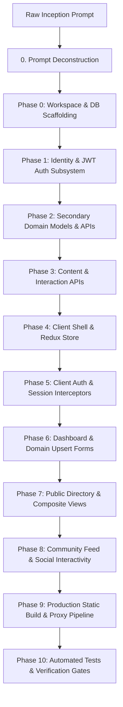

# Master Prompt-to-Fullstack Engineering Playbook
## The Architectural Blueprint for Synthesizing Production Fullstack Systems from Prompts

> **Document Type**: AI-Parseable Architecture Blueprint & Implementation Playbook  
> **Target Audience**: AI Coding Assistants (Antigravity Agents) & Senior Fullstack Engineers  
> **Reference Baseline**: DevConnector MERN Social Network (36 Git Commits: `ccda0ee` $\to$ `4ff61c4`)  
> **Reference Inception Prompt**: *"Build a social media web application that allows users to connect with software developers around the world."*  
> **Operational Directive**: When paired with **ANY** prompt, follow the 12 chronological phases below to systematically build a complete, resilient fullstack application with zero omissions, zero placeholders, and 100% architectural certainty.

---

## Table of Contents
- [0. AI Assistant Execution Protocol](#0-ai-assistant-execution-protocol)
- [1. Prompt Deconstruction Framework](#1-prompt-deconstruction-framework)
- [2. Phase 0: Workspace Scaffolding, Environment Plumbing & Error Handling (Commits 1–3)](#2-phase-0-workspace-scaffolding-environment-plumbing--error-handling-commits-13)
  - [2.1 Directory Structure & Package Manifest](#21-directory-structure--package-manifest)
  - [2.2 Root `package.json` Configuration](#22-root-packagejson-configuration)
  - [2.3 Resilient Database Connection (`config/db.js`)](#23-resilient-database-connection-configdbjs)
  - [2.4 Express Entrypoint & Modular Routing (`server.js`)](#24-express-entrypoint--modular-routing-serverjs)
  - [2.5 Environment Precedence, CORS vs. Proxy Strategy](#25-environment-precedence-cors-vs-proxy-strategy)
  - [2.6 Centralized Async Error Handling Middleware](#26-centralized-async-error-handling-middleware)
- [3. Phase 1: Identity, Cryptography & JWT Security Pipeline (Commits 4–8)](#3-phase-1-identity-cryptography--jwt-security-pipeline-commits-48)
  - [3.1 User Schema (`models/User.js`)](#31-user-schema-modelsuserjs)
  - [3.2 Registration & Cryptographic Hashing (`routes/api/users.js`)](#32-registration--cryptographic-hashing-routesapiusersjs)
  - [3.3 Dual-Header JWT Verification Filter (`middleware/auth.js`)](#33-dual-header-jwt-verification-filter-middlewareauthjs)
  - [3.4 Login & Identity Recovery (`routes/api/auth.js`)](#34-login--identity-recovery-routesapiauthjs)
  - [3.5 Mongoose CastError & ObjectId Sanitization Invariant](#35-mongoose-casterror--objectid-sanitization-invariant)
  - [3.6 Direct Media Upload Architecture (Multer Fallback Pattern)](#36-direct-media-upload-architecture-multer-fallback-pattern)
- [4. Phase 2: Secondary Domain Schemas & Profile Lifecycle (Commits 11–16)](#4-phase-2-secondary-domain-schemas--profile-lifecycle-commits-1116)
  - [4.1 Profile Schema Architecture (`models/Profile.js`)](#41-profile-schema-architecture-modelsprofilejs)
  - [4.2 Upsert Pattern & Array Management (`routes/api/profile.js`)](#42-upsert-pattern--array-management-routesapiprofilejs)
  - [4.3 Subdocument Atomic Updates (`experience.id()` and Positional Updates)](#43-subdocument-atomic-updates-experienceid-and-positional-updates)
  - [4.4 Transaction-Safe Cascading Account Purges](#44-transaction-safe-cascading-account-purges)
- [5. Phase 3: Content Engine, Idempotent Reactions & Threaded Moderation (Commits 17–19)](#5-phase-3-content-engine-idempotent-reactions--threaded-moderation-commits-1719)
  - [5.1 Post Schema (`models/Post.js`)](#51-post-schema-modelspostjs)
  - [5.2 Idempotent Reactions & Moderated Threads (`routes/api/posts.js`)](#52-idempotent-reactions--moderated-threads-routesapipostsjs)
  - [5.3 High-Concurrency Atomic Reactions (`$addToSet` & `$pull`)](#53-high-concurrency-atomic-reactions-addtoset--pull)
  - [5.4 Feed Pagination, Cursor Sorting & Query Filtering](#54-feed-pagination-cursor-sorting--query-filtering)
- [6. Phase 4: Client Architecture & Global Redux State Machine (Commits 20–23)](#6-phase-4-client-architecture--global-redux-state-machine-commits-2023)
  - [6.1 Action Types Ledger (`client/src/actions/types.js`)](#61-action-types-ledger-clientsrcactionstypesjs)
  - [6.2 Classic Redux Store Configuration (`client/src/store.js`)](#62-classic-redux-store-configuration-clientsrcstorejs)
  - [6.3 Modern Redux Toolkit (RTK) Equivalence Specification](#63-modern-redux-toolkit-rtk-equivalence-specification)
  - [6.4 Global Alert State Machine (`client/src/actions/alert.js`)](#64-global-alert-state-machine-clientsrcactionsalertjs)
- [7. Phase 5: Client Auth Pipeline, Interceptors & Session Persistence (Commits 24–26)](#7-phase-5-client-auth-pipeline-interceptors--session-persistence-commits-2426)
  - [7.1 Global Header Token Interceptor (`client/src/utils/setAuthToken.js`)](#71-global-header-token-interceptor-clientsrcutilssetauthtokenjs)
  - [7.2 Unified Axios Instance with Automatic 401 Session Eviction](#72-unified-axios-instance-with-automatic-401-session-eviction)
  - [7.3 Auth Action Creators & Token Hydration (`client/src/actions/auth.js`)](#73-auth-action-creators--token-hydration-clientsrcactionsauthjs)
  - [7.4 React Router v6 Programmatic Navigation Contract](#74-react-router-v6-programmatic-navigation-contract)
- [8. Phase 6: Dashboard & Core Domain Form State (Commits 27–32)](#8-phase-6-dashboard--core-domain-form-state-commits-2732)
  - [8.1 Route Authentication Guard (`client/src/components/routing/PrivateRoute.js`)](#81-route-authentication-guard-clientsrccomponentsroutingprivateroutejs)
  - [8.2 Dashboard Profile State Branching (`client/src/components/dashboard/Dashboard.js`)](#82-dashboard-profile-state-branching-clientsrccomponentsdashboarddashboardjs)
  - [8.3 Nested Object Form State Management Pattern](#83-nested-object-form-state-management-pattern)
- [9. Phase 7: Public Directory, Composite Views & External Widgets (Commits 33–35)](#9-phase-7-public-directory-composite-views--external-widgets-commits-3335)
  - [9.1 Public Profiles Directory (`client/src/components/profiles/Profiles.js`)](#91-public-profiles-directory-clientsrccomponentsprofilesprofilesjs)
  - [9.2 Secure Backend Proxying for Third-Party Services (`ProfileGithub.js`)](#92-secure-backend-proxying-for-third-party-services-profilegithubjs)
- [10. Phase 8: Social Feed & Threaded Discussion Interactions (Commit 36)](#10-phase-8-social-feed--threaded-discussion-interactions-commit-36)
  - [10.1 Post Item Component with Author Verification (`client/src/components/posts/PostItem.js`)](#101-post-item-component-with-author-verification-clientsrccomponentspostspostitemjs)
  - [10.2 Optimistic UI Updates vs. Pessimistic State Synchronization](#102-optimistic-ui-updates-vs-pessimistic-state-synchronization)
- [11. Phase 9: Production Static Asset Serving & Build Pipeline](#11-phase-9-production-static-asset-serving--build-pipeline)
- [12. Phase 10: Automated Testing & Verification Suite](#12-phase-10-automated-testing--verification-suite)
- [13. Universal Prompt-to-System Execution Algorithm](#13-universal-prompt-to-system-execution-algorithm)
- [14. Verification Quality Gates & Production Invariants](#14-verification-quality-gates--production-invariants)

---

## 0. AI Assistant Execution Protocol

When an AI assistant receives a prompt to build a software system, it must not write scattered or ad-hoc code. It must execute the engineering phases in strict chronological dependency order:



### Golden Engineering Invariants
1. **Backend First, Frontend Second**: Never build frontend forms before backend endpoints and database models exist to receive the data.
2. **Identity Before Features**: Always establish user registration, password hashing, and token authentication before building domain resources.
3. **Redux Store Before UI Components**: Always define action types and reducers before building React components that dispatch them.
4. **Idempotency & Cascade Safety**: Every resource deletion must enforce owner verification and cascade-clean all associated subdocuments.
5. **No Secrets in Client Bundles**: Any third-party API that requires an API key or secret token must be queried via an Express backend proxy route.
6. **Graceful CastError Degradation**: Any route accepting a MongoDB ObjectId in its URL params must catch invalid format strings and return a 404 response instead of throwing an unhandled 500 error.

---

## 1. Prompt Deconstruction Framework

Every fullstack system starts with an informal prompt. To transform any prompt into an architecture, execute this 5-dimensional deconstruction:

### The 5-Dimensional Extraction Heuristic

| Dimension | DevConnector Reference Prompt | Universal Application to ANY Prompt |
| :--- | :--- | :--- |
| **1. Primary Domain Entities** | `User`, `Profile`, `Experience`, `Education`, `Post`, `Comment`, `Like` | Identify core nouns: Who acts? What items are listed, rented, bought, or shared? What sub-items exist? |
| **2. Actor Taxonomy** | Unregistered Visitor, Authenticated Developer, External GitHub API | Identify primary human actors, admin actors, and third-party web services. |
| **3. Relationship Multiplicity** | `User` 1:1 `Profile`<br>`User` 1:N `Post`<br>`Post` 1:N embedded `Comments` / `Likes` | Determine which entities are normalized tables/collections vs. embedded subdocument arrays. |
| **4. Security & Access Tiers** | Public: Browse Profiles/Feed<br>Private: Dashboard, Upsert Profile, Add Post, Like | Classify every action as Public (anonymous) or Private (requires verified JWT claim). |
| **5. External Integrations** | Gravatar (Avatars), GitHub API (Repository portfolios) | Identify payment gateways (Stripe), email dispatchers (SendGrid), or cloud media (S3). |

---

## 2. Phase 0: Workspace Scaffolding, Environment Plumbing & Error Handling (Commits 1–3)

### Git Commit Milestones
- `ccda0ee initial commit`: Package initialization, Express app shell, port binding.
- `58f38e8 initialised database`: MongoDB connection abstraction with Mongoose.
- `73364af setup default routes for api endpoints`: Modular Express routing structure.

### 2.1 Directory Structure & Package Manifest
```text
/ (root)
├── package.json              # Orchestrator with concurrently & nodemon
├── server.js                 # Express application entrypoint
├── config/
│   ├── db.js                 # Database connection logic
│   └── default.json          # Configuration constants (MongoURI, jwtSecret)
├── middleware/               # Express request pipeline filters (auth, error)
├── models/                   # Mongoose data schemas
├── routes/
│   └── api/                  # Modular REST route handlers
└── client/                   # React SPA frontend (Phase 4 onwards)
    ├── package.json          # Frontend dependencies & dev proxy
    ├── public/               # HTML template & static assets
    └── src/                  # React source tree
```

### 2.2 Root `package.json` Configuration
```json
{
  "name": "fullstack_system",
  "version": "1.0.0",
  "main": "server.js",
  "scripts": {
    "start": "node server",
    "server": "nodemon server",
    "client": "npm start --prefix client",
    "dev": "concurrently \"npm run server\" \"npm run client\"",
    "build": "npm install && npm install --prefix client && npm run build --prefix client"
  },
  "dependencies": {
    "bcryptjs": "^3.0.3",
    "config": "^5.0.0",
    "dotenv": "^16.4.7",
    "express": "^5.2.1",
    "express-validator": "^7.3.2",
    "gravatar": "^1.8.2",
    "jsonwebtoken": "^9.0.3",
    "mongoose": "^9.9.2"
  },
  "devDependencies": {
    "concurrently": "^10.0.4",
    "nodemon": "^3.1.14"
  }
}
```

### 2.3 Resilient Database Connection (`config/db.js`)
```javascript
const mongoose = require('mongoose');
const config = require('config');

// Support both node-config default.json and environment variables
const getMongoURI = () => {
  if (process.env.MONGO_URI) return process.env.MONGO_URI;
  if (config.has('mongoURI')) return config.get('mongoURI');
  return 'mongodb://localhost:27017/devconnector';
};

const connectDB = async () => {
  try {
    const conn = await mongoose.connect(getMongoURI());
    console.log(`MongoDB Connected: ${conn.connection.host}`);
  } catch (err) {
    console.error('Database Connection Error:', err.message);
    // Exit process with failure code if connection fails
    process.exit(1);
  }
};

module.exports = connectDB;
```

### 2.4 Express Entrypoint & Modular Routing (`server.js`)
```javascript
const express = require('express');
const connectDB = require('./config/db');
const errorHandler = require('./middleware/errorHandler');

const app = express();

// Connect Database
connectDB();

// Init Middleware for JSON body parsing
app.use(express.json());

// Define Modular REST Routes
app.use('/api/users', require('./routes/api/users'));
app.use('/api/auth', require('./routes/api/auth'));
app.use('/api/profile', require('./routes/api/profile'));
app.use('/api/posts', require('./routes/api/posts'));

// Centralized Error Handling Middleware (must be after routes)
app.use(errorHandler);

const PORT = process.env.PORT || 5000;
app.listen(PORT, () => console.log(`Server started on port ${PORT}`));
```

### 2.5 Environment Precedence, CORS vs. Proxy Strategy

In a fullstack MERN application, the React client runs on `http://localhost:3000` while Express runs on `http://localhost:5000`. To prevent CORS errors during development:

1. **Development Proxy Pattern (Recommended)**:
   In `client/package.json`, add:
   ```json
   "proxy": "http://localhost:5000"
   ```
   When the client calls `axios.get('/api/auth')`, the development Webpack dev server automatically forwards the request to port 5000. No CORS headers are needed.

2. **Decoupled / Microservice CORS Pattern**:
   If the frontend and backend are hosted on separate domains in production, use the `cors` middleware in `server.js`:
   ```javascript
   const cors = require('cors');
   app.use(cors({
     origin: process.env.CLIENT_URL || 'http://localhost:3000',
     credentials: true,
     allowedHeaders: ['Content-Type', 'x-auth-token', 'Authorization']
   }));
   ```

### 2.6 Centralized Async Error Handling Middleware (`middleware/errorHandler.js`)
```javascript
module.exports = function (err, req, res, next) {
  console.error('Unhandled Error caught in middleware:', err.stack || err.message);

  // Mongoose Bad ObjectId (CastError)
  if (err.name === 'CastError' && err.kind === 'ObjectId') {
    return res.status(404).json({ msg: 'Resource not found with specified identifier' });
  }

  // Mongoose Validation Error
  if (err.name === 'ValidationError') {
    const messages = Object.values(err.errors).map(val => val.message);
    return res.status(400).json({ errors: messages.map(msg => ({ msg })) });
  }

  // Duplicate Key Error (E11000)
  if (err.code === 11000) {
    const field = Object.keys(err.keyValue)[0];
    return res.status(400).json({ errors: [{ msg: `A record with that ${field} already exists` }] });
  }

  // Default Internal Server Error
  res.status(err.status || 500).json({
    msg: process.env.NODE_ENV === 'production' ? 'Server Error' : err.message
  });
};
```

---

## 3. Phase 1: Identity, Cryptography & JWT Security Pipeline (Commits 4–8)

### Git Commit Milestones
- `790186b created User model and schema`: Mongoose User model with unique email index.
- `8bcac8c initialised user registration`: Input sanitization via `express-validator`.
- `78bb7b6 added user avatar and initial verification stage`: Gravatar derivation, checking existing user.
- `1da66c2 added JWT for password hashing`: Salt factor 10 bcrypt, token signing.
- `0acae10 Login verification features added`: Authentication middleware, credential comparison, private user retrieval.

### 3.1 User Schema (`models/User.js`)
```javascript
const mongoose = require('mongoose');

const UserSchema = new mongoose.Schema({
  name: { type: String, required: true, trim: true },
  email: { type: String, required: true, unique: true, lowercase: true, trim: true },
  password: { type: String, required: true },
  avatar: { type: String },
  date: { type: Date, default: Date.now }
});

module.exports = User = mongoose.model('user', UserSchema);
```

### 3.2 Registration & Cryptographic Hashing (`routes/api/users.js`)
```javascript
const express = require('express');
const router = express.Router();
const gravatar = require('gravatar');
const bcrypt = require('bcryptjs');
const jwt = require('jsonwebtoken');
const config = require('config');
const { check, validationResult } = require('express-validator');
const User = require('../../models/User');

const getJwtSecret = () => process.env.JWT_SECRET || config.get('jwtSecret');

// @route   POST api/users
// @desc    Register developer user
// @access  Public
router.post(
  '/',
  [
    check('name', 'Name is required').not().isEmpty(),
    check('email', 'Please include a valid email').isEmail(),
    check('password', 'Please enter a password with 6 or more characters').isLength({ min: 6 })
  ],
  async (req, res) => {
    const errors = validationResult(req);
    if (!errors.isEmpty()) {
      return res.status(400).json({ errors: errors.array() });
    }

    const { name, email, password } = req.body;

    try {
      // 1. Verify user does not already exist
      let user = await User.findOne({ email });
      if (user) {
        return res.status(400).json({ errors: [{ msg: 'User already exists' }] });
      }

      // 2. Derive avatar from email hash (pg rated, mm default placeholder)
      const avatar = gravatar.url(email, { s: '200', r: 'pg', d: 'mm' });

      user = new User({ name, email, avatar, password });

      // 3. Encrypt password using bcrypt (Salt factor 10)
      const salt = await bcrypt.genSalt(10);
      user.password = await bcrypt.hash(password, salt);
      await user.save();

      // 4. Issue stateless JWT
      const payload = { user: { id: user.id } };
      jwt.sign(payload, getJwtSecret(), { expiresIn: 360000 }, (err, token) => {
        if (err) throw err;
        res.json({ token });
      });
    } catch (err) {
      console.error(err.message);
      res.status(500).send('Server Error');
    }
  }
);

module.exports = router;
```

### 3.3 Dual-Header JWT Verification Filter (`middleware/auth.js`)

To ensure maximum interoperability across traditional frontend headers and modern mobile or third-party consumers, the auth middleware supports both `x-auth-token` and `Authorization: Bearer <token>`:

```javascript
const jwt = require('jsonwebtoken');
const config = require('config');

const getJwtSecret = () => process.env.JWT_SECRET || config.get('jwtSecret');

module.exports = function (req, res, next) {
  // Extract token from either x-auth-token or Authorization: Bearer
  let token = req.header('x-auth-token');
  
  if (!token && req.header('authorization')) {
    const authHeader = req.header('authorization');
    if (authHeader.startsWith('Bearer ')) {
      token = authHeader.split(' ')[1];
    }
  }

  // Check if no token is present
  if (!token) {
    return res.status(401).json({ msg: 'No token, authorization denied' });
  }

  // Verify token signature and expiration
  try {
    const decoded = jwt.verify(token, getJwtSecret());
    req.user = decoded.user;
    next();
  } catch (err) {
    res.status(401).json({ msg: 'Token is not valid' });
  }
};
```

### 3.4 Login & Identity Recovery (`routes/api/auth.js`)
```javascript
const express = require('express');
const router = express.Router();
const bcrypt = require('bcryptjs');
const jwt = require('jsonwebtoken');
const config = require('config');
const { check, validationResult } = require('express-validator');
const auth = require('../../middleware/auth');
const User = require('../../models/User');

const getJwtSecret = () => process.env.JWT_SECRET || config.get('jwtSecret');

// @route   GET api/auth
// @desc    Get authenticated user payload
// @access  Private
router.get('/', auth, async (req, res) => {
  try {
    const user = await User.findById(req.user.id).select('-password');
    res.json(user);
  } catch (err) {
    console.error(err.message);
    res.status(500).send('Server Error');
  }
});

// @route   POST api/auth
// @desc    Authenticate user & get token
// @access  Public
router.post(
  '/',
  [
    check('email', 'Please include a valid email').isEmail(),
    check('password', 'Password is required').exists()
  ],
  async (req, res) => {
    const errors = validationResult(req);
    if (!errors.isEmpty()) {
      return res.status(400).json({ errors: errors.array() });
    }

    const { email, password } = req.body;

    try {
      let user = await User.findOne({ email });
      if (!user) {
        return res.status(400).json({ errors: [{ msg: 'Invalid Credentials' }] });
      }

      const isMatch = await bcrypt.compare(password, user.password);
      if (!isMatch) {
        return res.status(400).json({ errors: [{ msg: 'Invalid Credentials' }] });
      }

      const payload = { user: { id: user.id } };
      jwt.sign(payload, getJwtSecret(), { expiresIn: 360000 }, (err, token) => {
        if (err) throw err;
        res.json({ token });
      });
    } catch (err) {
      console.error(err.message);
      res.status(500).send('Server Error');
    }
  }
);

module.exports = router;
```

### 3.5 Mongoose CastError & ObjectId Sanitization Invariant

Whenever an endpoint fetches a resource using a route parameter (e.g. `req.params.user_id`), passing a non-hexadecimal 24-character string (such as `/api/profile/user/12345`) triggers Mongoose `CastError`. If not handled explicitly, this returns HTTP 500 instead of HTTP 404:

```javascript
// Universal ObjectId Safe Handler Pattern
router.get('/user/:user_id', async (req, res) => {
  try {
    const profile = await Profile.findOne({ user: req.params.user_id }).populate('user', ['name', 'avatar']);
    if (!profile) return res.status(404).json({ msg: 'Profile not found' });
    res.json(profile);
  } catch (err) {
    console.error(err.message);
    if (err.kind === 'ObjectId' || err.name === 'CastError') {
      return res.status(404).json({ msg: 'Profile not found' });
    }
    res.status(500).send('Server Error');
  }
});
```

### 3.6 Direct Media Upload Architecture (Multer Fallback Pattern)

If a prompt specifies custom photo or document uploads instead of Gravatar email hashes, implement this universal Multer upload filter:

```javascript
// middleware/upload.js
const multer = require('multer');
const path = require('path');

const storage = multer.diskStorage({
  destination: (req, file, cb) => cb(null, 'uploads/'),
  filename: (req, file, cb) => cb(null, `${req.user.id}-${Date.now()}${path.extname(file.originalname)}`)
});

const fileFilter = (req, file, cb) => {
  const filetypes = /jpeg|jpg|png|webp/;
  const extname = filetypes.test(path.extname(file.originalname).toLowerCase());
  const mimetype = filetypes.test(file.mimetype);

  if (mimetype && extname) return cb(null, true);
  cb(new Error('Only images (.jpg, .jpeg, .png, .webp) are allowed!'));
};

const upload = multer({
  storage,
  limits: { fileSize: 2 * 1024 * 1024 }, // 2MB
  fileFilter
});

module.exports = upload;
```

---

## 4. Phase 2: Secondary Domain Schemas & Profile Lifecycle (Commits 11–16)

### Git Commit Milestones
- `17e008d create and update profile feature`: 1:1 Profile model, upsert logic via `findOneAndUpdate`.
- `3db2f9b get all profiles and get user by user id`: Public directory lookups with ObjectId error handling.
- `9feccb3 delete user and profile`: Cascading deletion across `posts`, `profiles`, and `users`.
- `92b52f4 add user experience`: Array `$unshift` of experience subdocuments.
- `f41b73e add and delete education features`: Education subdocument insertion and array filtering.
- `f864ec0 added access to github repos from username`: External GitHub API ingestion with Axios.

### 4.1 Profile Schema Architecture (`models/Profile.js`)
```javascript
const mongoose = require('mongoose');

const ProfileSchema = new mongoose.Schema({
  user: { type: mongoose.Schema.Types.ObjectId, ref: 'user', required: true, unique: true },
  company: { type: String },
  website: { type: String },
  location: { type: String },
  status: { type: String, required: true },
  skills: { type: [String], required: true },
  bio: { type: String },
  githubusername: { type: String },
  experience: [
    {
      title: { type: String, required: true },
      company: { type: String, required: true },
      location: { type: String },
      from: { type: Date, required: true },
      to: { type: Date },
      current: { type: Boolean, default: false },
      description: { type: String }
    }
  ],
  education: [
    {
      school: { type: String, required: true },
      degree: { type: String, required: true },
      fieldofstudy: { type: String, required: true },
      from: { type: Date, required: true },
      to: { type: Date },
      current: { type: Boolean, default: false },
      description: { type: String }
    }
  ],
  social: {
    youtube: { type: String },
    twitter: { type: String },
    facebook: { type: String },
    linkedin: { type: String },
    instagram: { type: String }
  },
  date: { type: Date, default: Date.now }
});

module.exports = mongoose.model('Profile', ProfileSchema);
```

### 4.2 Upsert Pattern & Array Management (`routes/api/profile.js`)
```javascript
const express = require('express');
const router = express.Router();
const auth = require('../../middleware/auth');
const { check, validationResult } = require('express-validator');
const Profile = require('../../models/Profile');
const User = require('../../models/User');
const Post = require('../../models/Post');

// @route   POST api/profile
// @desc    Create or update user profile (Upsert)
// @access  Private
router.post(
  '/',
  [auth, [
    check('status', 'Status is required').not().isEmpty(),
    check('skills', 'Skills is required').not().isEmpty()
  ]],
  async (req, res) => {
    const errors = validationResult(req);
    if (!errors.isEmpty()) return res.status(400).json({ errors: errors.array() });

    const {
      company, website, location, bio, status, githubusername,
      skills, youtube, twitter, facebook, linkedin, instagram
    } = req.body;

    const profileFields = {
      user: req.user.id,
      company, website, location, bio, status, githubusername,
      skills: Array.isArray(skills) ? skills : skills.split(',').map(skill => skill.trim()),
      social: { youtube, twitter, facebook, linkedin, instagram }
    };

    try {
      const profile = await Profile.findOneAndUpdate(
        { user: req.user.id },
        { $set: profileFields },
        { new: true, upsert: true, setDefaultsOnInsert: true }
      );
      return res.json(profile);
    } catch (err) {
      console.error(err.message);
      res.status(500).send('Server Error');
    }
  }
);

// @route   PUT api/profile/experience
// @desc    Add experience to profile
// @access  Private
router.put(
  '/experience',
  [auth, [
    check('title', 'Title is required').not().isEmpty(),
    check('company', 'Company is required').not().isEmpty(),
    check('from', 'From date is required').not().isEmpty()
  ]],
  async (req, res) => {
    const errors = validationResult(req);
    if (!errors.isEmpty()) return res.status(400).json({ errors: errors.array() });

    try {
      const profile = await Profile.findOne({ user: req.user.id });
      if (!profile) return res.status(400).json({ msg: 'Profile not found' });

      profile.experience.unshift(req.body);
      await profile.save();
      res.json(profile);
    } catch (err) {
      console.error(err.message);
      res.status(500).send('Server Error');
    }
  }
);

// @route   DELETE api/profile/experience/:exp_id
// @desc    Delete experience from profile
// @access  Private
router.delete('/experience/:exp_id', auth, async (req, res) => {
  try {
    const profile = await Profile.findOne({ user: req.user.id });
    profile.experience = profile.experience.filter(exp => exp._id.toString() !== req.params.exp_id);
    await profile.save();
    res.json(profile);
  } catch (err) {
    console.error(err.message);
    res.status(500).send('Server Error');
  }
});
```

### 4.3 Subdocument Atomic Updates (`experience.id()` and Positional Updates)

When editing an existing subdocument (rather than appending or deleting), use Mongoose's built-in subdocument helper `.id()`:

```javascript
// @route   PUT api/profile/experience/:exp_id
// @desc    Update specific experience subdocument
// @access  Private
router.put('/experience/:exp_id', auth, async (req, res) => {
  try {
    const profile = await Profile.findOne({ user: req.user.id });
    const exp = profile.experience.id(req.params.exp_id);
    if (!exp) return res.status(404).json({ msg: 'Experience entry not found' });

    // Mutate existing fields
    Object.assign(exp, req.body);
    await profile.save();
    res.json(profile);
  } catch (err) {
    console.error(err.message);
    res.status(500).send('Server Error');
  }
});
```

### 4.4 Transaction-Safe Cascading Account Purges

To guarantee data consistency when deleting a user, all associated records (`Post`, `Profile`, `User`) must be completely purged. For MongoDB replica sets, use transactions; for standalone nodes, execute sequential or parallel cleanup:

```javascript
// @route   DELETE api/profile
// @desc    Delete profile, user & authored posts
// @access  Private
router.delete('/', auth, async (req, res) => {
  try {
    // Purge in parallel across collections
    await Promise.all([
      Post.deleteMany({ user: req.user.id }),
      Profile.findOneAndDelete({ user: req.user.id }),
      User.findOneAndDelete({ _id: req.user.id })
    ]);
    res.json({ msg: 'User and all associated data permanently deleted' });
  } catch (err) {
    console.error(err.message);
    res.status(500).send('Server Error');
  }
});
```

---

## 5. Phase 3: Content Engine, Idempotent Reactions & Threaded Moderation (Commits 17–19)

### Git Commit Milestones
- `46b5027 Posts: create, fetch by ID, and delete by ID`: Post schema, author hydration, author ownership checks.
- `aa783a0 added like and unlike a post features`: Array idempotency filtering for likes.
- `8e03eeb Add and remove comment route`: Subdocument comments array and comment author validation.

### 5.1 Post Schema (`models/Post.js`)
```javascript
const mongoose = require('mongoose');

const PostSchema = new mongoose.Schema({
  user: { type: mongoose.Schema.Types.ObjectId, ref: 'user', required: true },
  text: { type: String, required: true },
  name: { type: String },
  avatar: { type: String },
  likes: [{ user: { type: mongoose.Schema.Types.ObjectId, ref: 'user' } }],
  comments: [
    {
      user: { type: mongoose.Schema.Types.ObjectId, ref: 'user' },
      text: { type: String, required: true },
      name: { type: String },
      avatar: { type: String },
      date: { type: Date, default: Date.now }
    }
  ],
  date: { type: Date, default: Date.now }
});

module.exports = Post = mongoose.model('post', PostSchema);
```

### 5.2 Idempotent Reactions & Moderated Threads (`routes/api/posts.js`)
```javascript
const express = require('express');
const router = express.Router();
const auth = require('../../middleware/auth');
const { check, validationResult } = require('express-validator');
const Post = require('../../models/Post');
const User = require('../../models/User');

// @route   POST api/posts
// @desc    Create a post
// @access  Private
router.post(
  '/',
  [auth, [check('text', 'Text is required').not().isEmpty()]],
  async (req, res) => {
    const errors = validationResult(req);
    if (!errors.isEmpty()) return res.status(400).json({ errors: errors.array() });

    try {
      const user = await User.findById(req.user.id).select('-password');
      const newPost = new Post({
        text: req.body.text,
        name: user.name,
        avatar: user.avatar,
        user: req.user.id
      });

      const post = await newPost.save();
      res.json(post);
    } catch (err) {
      console.error(err.message);
      res.status(500).send('Server Error');
    }
  }
);

// @route   DELETE api/posts/:id
// @desc    Delete a post by ID (Author Ownership Guard)
// @access  Private
router.delete('/:id', auth, async (req, res) => {
  try {
    const post = await Post.findById(req.params.id);
    if (!post) return res.status(404).json({ msg: 'Post not found' });

    // Invariant: Non-authors cannot delete
    if (post.user.toString() !== req.user.id) {
      return res.status(401).json({ msg: 'User not authorised' });
    }

    await post.deleteOne();
    res.json({ msg: 'Post removed' });
  } catch (err) {
    console.error(err.message);
    if (err.kind === 'ObjectId') return res.status(404).json({ msg: 'Post not found' });
    res.status(500).send('Server Error');
  }
});

// @route   POST api/posts/comment/:id
// @desc    Comment on a post
// @access  Private
router.post(
  '/comment/:id',
  [auth, [check('text', 'Text is required').not().isEmpty()]],
  async (req, res) => {
    const errors = validationResult(req);
    if (!errors.isEmpty()) return res.status(400).json({ errors: errors.array() });

    try {
      const user = await User.findById(req.user.id).select('-password');
      const post = await Post.findById(req.params.id);
      if (!post) return res.status(404).json({ msg: 'Post not found' });

      const newComment = {
        text: req.body.text,
        name: user.name,
        avatar: user.avatar,
        user: req.user.id
      };

      post.comments.unshift(newComment);
      await post.save();
      res.json(post.comments);
    } catch (err) {
      console.error(err.message);
      res.status(500).send('Server Error');
    }
  }
);

// @route   DELETE api/posts/comment/:id/:comment_id
// @desc    Delete comment (Comment Author Guard)
// @access  Private
router.delete('/comment/:id/:comment_id', auth, async (req, res) => {
  try {
    const post = await Post.findById(req.params.id);
    if (!post) return res.status(404).json({ msg: 'Post not found' });

    const comment = post.comments.find(c => c.id === req.params.comment_id);
    if (!comment) return res.status(404).json({ msg: 'Comment does not exist' });

    if (comment.user.toString() !== req.user.id) {
      return res.status(401).json({ msg: 'User not authorised' });
    }

    post.comments = post.comments.filter(c => c.id !== req.params.comment_id);
    await post.save();
    res.json(post.comments);
  } catch (err) {
    console.error(err.message);
    res.status(500).send('Server Error');
  }
});
```

### 5.3 High-Concurrency Atomic Reactions (`$addToSet` & `$pull`)

In high-concurrency systems, fetching a post document, modifying its JavaScript array, and calling `.save()` is vulnerable to race conditions. The production standard is MongoDB atomic operators:

```javascript
// PUT api/posts/like/:id -> Atomic Idempotent Like
router.put('/like/:id', auth, async (req, res) => {
  try {
    // $addToSet ensures the user ID is added ONLY if it does not already exist
    const post = await Post.findOneAndUpdate(
      { _id: req.params.id, 'likes.user': { $ne: req.user.id } },
      { $push: { likes: { user: req.user.id } } },
      { new: true }
    );

    if (!post) {
      // Check if post existed or was already liked
      const exists = await Post.findById(req.params.id);
      if (!exists) return res.status(404).json({ msg: 'Post not found' });
      return res.status(400).json({ msg: 'Post already liked' });
    }

    res.json(post.likes);
  } catch (err) {
    console.error(err.message);
    res.status(500).send('Server Error');
  }
});

// PUT api/posts/unlike/:id -> Atomic Idempotent Unlike
router.put('/unlike/:id', auth, async (req, res) => {
  try {
    const post = await Post.findOneAndUpdate(
      { _id: req.params.id, 'likes.user': req.user.id },
      { $pull: { likes: { user: req.user.id } } },
      { new: true }
    );

    if (!post) {
      return res.status(400).json({ msg: 'Post has not yet been liked' });
    }

    res.json(post.likes);
  } catch (err) {
    console.error(err.message);
    res.status(500).send('Server Error');
  }
});
```

### 5.4 Feed Pagination, Cursor Sorting & Query Filtering

To prevent memory exhaustion on large feeds, implement this query pagination pattern:

```javascript
// GET api/posts?page=1&limit=10
router.get('/', auth, async (req, res) => {
  try {
    const page = parseInt(req.query.page, 10) || 1;
    const limit = parseInt(req.query.limit, 10) || 10;
    const skip = (page - 1) * limit;

    const [posts, totalPosts] = await Promise.all([
      Post.find().sort({ date: -1 }).skip(skip).limit(limit),
      Post.countDocuments()
    ]);

    res.json({
      posts,
      currentPage: page,
      totalPages: Math.ceil(totalPosts / limit),
      totalPosts
    });
  } catch (err) {
    console.error(err.message);
    res.status(500).send('Server Error');
  }
});
```

---

## 6. Phase 4: Client Architecture & Global Redux State Machine (Commits 20–23)

### Git Commit Milestones
- `3a078f6 initialised frontend with login and register links`: Create-React-App shell, React Router v6, layout components.
- `b861fc3 setup redux store to enable use of action reducers`: Redux store, thunk, composeWithDevTools, rootReducer.
- `ccdfc36 setup alerts and events to capture login/registration errors`: Global alert slice, UUID generation, auto-dismiss timeouts.

### 6.1 Action Types Ledger (`client/src/actions/types.js`)
```javascript
export const SET_ALERT = 'SET_ALERT';
export const REMOVE_ALERT = 'REMOVE_ALERT';

export const REGISTER_SUCCESS = 'REGISTER_SUCCESS';
export const REGISTER_FAIL = 'REGISTER_FAIL';
export const USER_LOADED = 'USER_LOADED';
export const AUTH_ERROR = 'AUTH_ERROR';
export const LOGIN_SUCCESS = 'LOGIN_SUCCESS';
export const LOGIN_FAIL = 'LOGIN_FAIL';
export const LOGOUT = 'LOGOUT';

export const GET_PROFILE = 'GET_PROFILE';
export const GET_PROFILES = 'GET_PROFILES';
export const GET_REPOS = 'GET_REPOS';
export const UPDATE_PROFILE = 'UPDATE_PROFILE';
export const CLEAR_PROFILE = 'CLEAR_PROFILE';
export const PROFILE_ERROR = 'PROFILE_ERROR';
export const ACCOUNT_DELETED = 'ACCOUNT_DELETED';

export const GET_POSTS = 'GET_POSTS';
export const GET_POST = 'GET_POST';
export const POST_ERROR = 'POST_ERROR';
export const UPDATE_LIKES = 'UPDATE_LIKES';
export const DELETE_POST = 'DELETE_POST';
export const ADD_POST = 'ADD_POST';
export const ADD_COMMENT = 'ADD_COMMENT';
export const REMOVE_COMMENT = 'REMOVE_COMMENT';
```

### 6.2 Classic Redux Store Configuration (`client/src/store.js`)
```javascript
import { createStore, applyMiddleware } from 'redux';
import { composeWithDevTools } from '@redux-devtools/extension';
import thunk from 'redux-thunk';
import rootReducer from './reducers';

const initialState = {};
const middleware = [thunk];

const store = createStore(
  rootReducer,
  initialState,
  composeWithDevTools(applyMiddleware(...middleware))
);

export default store;
```

### 6.3 Modern Redux Toolkit (RTK) Equivalence Specification

If implementing with modern `@reduxjs/toolkit` instead of classic Redux, use `configureStore` and `createSlice`:

```javascript
// client/src/store.js (Modern RTK equivalent)
import { configureStore } from '@reduxjs/toolkit';
import alertReducer from './features/alertSlice';
import authReducer from './features/authSlice';
import profileReducer from './features/profileSlice';
import postReducer from './features/postSlice';

const store = configureStore({
  reducer: {
    alert: alertReducer,
    auth: authReducer,
    profile: profileReducer,
    post: postReducer
  }
});

export default store;
```

### 6.4 Global Alert State Machine (`client/src/actions/alert.js`)
```javascript
import { v4 as uuidv4 } from 'uuid';
import { SET_ALERT, REMOVE_ALERT } from './types';

export const setAlert = (msg, alertType, timeout = 5000) => (dispatch) => {
  const id = uuidv4();
  dispatch({
    type: SET_ALERT,
    payload: { msg, alertType, id }
  });

  setTimeout(() => dispatch({ type: REMOVE_ALERT, payload: id }), timeout);
};
```

---

## 7. Phase 5: Client Auth Pipeline, Interceptors & Session Persistence (Commits 24–26)

### Git Commit Milestones
- `11e3c6a register user, load user action, get user back, set authenticator true/false`: `setAuthToken` header utility, `loadUser`.
- `65488a5 User login and Register action and reducer`: JWT persistence, `LOGIN_SUCCESS`, `AUTH_ERROR`.
- `0089047 added logout feature`: Clearing tokens, Navbar state toggling.

### 7.1 Global Header Token Interceptor (`client/src/utils/setAuthToken.js`)
```javascript
import axios from 'axios';

const setAuthToken = (token) => {
  if (token) {
    axios.defaults.headers.common['x-auth-token'] = token;
    localStorage.setItem('token', token);
  } else {
    delete axios.defaults.headers.common['x-auth-token'];
    localStorage.removeItem('token');
  }
};

export default setAuthToken;
```

### 7.2 Unified Axios Instance with Automatic 401 Session Eviction (`client/src/utils/api.js`)

To prevent infinite loops and gracefully handle token expiration across all HTTP requests, centralize Axios configuration:

```javascript
import axios from 'axios';
import store from '../store';
import { LOGOUT } from '../actions/types';

const api = axios.create({
  baseURL: '/api',
  headers: {
    'Content-Type': 'application/json'
  }
});

// Request Interceptor: Attach token if present
api.interceptors.request.use(
  (config) => {
    const token = localStorage.getItem('token');
    if (token) {
      config.headers['x-auth-token'] = token;
    }
    return config;
  },
  (error) => Promise.reject(error)
);

// Response Interceptor: Catch 401 Unauthorized and auto-logout
api.interceptors.response.use(
  (res) => res,
  (err) => {
    if (err.response && err.response.status === 401) {
      store.dispatch({ type: LOGOUT });
    }
    return Promise.reject(err);
  }
);

export default api;
```

### 7.3 Auth Action Creators & Token Hydration (`client/src/actions/auth.js`)
```javascript
import axios from 'axios';
import { setAlert } from './alert';
import {
  REGISTER_SUCCESS, REGISTER_FAIL, USER_LOADED,
  AUTH_ERROR, LOGIN_SUCCESS, LOGIN_FAIL, LOGOUT, CLEAR_PROFILE
} from './types';
import setAuthToken from '../utils/setAuthToken';

// Load Authenticated User
export const loadUser = () => async (dispatch) => {
  if (localStorage.token) {
    setAuthToken(localStorage.token);
  }
  try {
    const res = await axios.get('/api/auth');
    dispatch({ type: USER_LOADED, payload: res.data });
  } catch (err) {
    dispatch({ type: AUTH_ERROR });
  }
};

// Register User
export const register = ({ name, email, password }) => async (dispatch) => {
  try {
    const res = await axios.post('/api/users', { name, email, password });
    dispatch({ type: REGISTER_SUCCESS, payload: res.data });
    dispatch(loadUser());
  } catch (err) {
    const errors = err.response?.data?.errors;
    if (errors) {
      errors.forEach((error) => dispatch(setAlert(error.msg, 'danger')));
    }
    dispatch({ type: REGISTER_FAIL });
  }
};

// Login User
export const login = (email, password) => async (dispatch) => {
  try {
    const res = await axios.post('/api/auth', { email, password });
    dispatch({ type: LOGIN_SUCCESS, payload: res.data });
    dispatch(loadUser());
  } catch (err) {
    const errors = err.response?.data?.errors;
    if (errors) {
      errors.forEach((error) => dispatch(setAlert(error.msg, 'danger')));
    }
    dispatch({ type: LOGIN_FAIL });
  }
};

// Logout User / Clear State
export const logout = () => (dispatch) => {
  dispatch({ type: CLEAR_PROFILE });
  dispatch({ type: LOGOUT });
};
```

### 7.4 React Router v6 Programmatic Navigation Contract

In React Router v6, `history.push` is deprecated. Pass the `navigate` function obtained from `useNavigate()` into thunks:

```javascript
// Calling an action creator with navigate
const navigate = useNavigate();
dispatch(createProfile(formData, navigate, edit ? true : false));

// Action creator implementation
export const createProfile = (formData, navigate, edit = false) => async (dispatch) => {
  try {
    const res = await axios.post('/api/profile', formData);
    dispatch({ type: GET_PROFILE, payload: res.data });
    dispatch(setAlert(edit ? 'Profile Updated' : 'Profile Created', 'success'));

    if (!edit) {
      navigate('/dashboard');
    }
  } catch (err) {
    const errors = err.response?.data?.errors;
    if (errors) {
      errors.forEach((error) => dispatch(setAlert(error.msg, 'danger')));
    }
    dispatch({
      type: PROFILE_ERROR,
      payload: { msg: err.response?.statusText, status: err.response?.status }
    });
  }
};
```

---

## 8. Phase 6: Dashboard & Core Domain Form State (Commits 27–32)

### Git Commit Milestones
- `7eff28b get users profile reducer and action`: `getCurrentProfile`, Redux profile slice.
- `372ac39 added action for whether a user has a profile or not`: `PrivateRoute` guard, Dashboard empty-state routing.
- `3a1caa1 create profile form`: Dynamic form inputs, social media toggle.
- `7e6e1b4 Create and Edit profile on dashboard created`: Profile pre-population in `EditProfile.js`.
- `68676d9 Add and Edit Experience & Education`: Subdocument form arrays with `current` checkbox disabling `to` date.
- `3b3b506 feature to delete education, experience, and entire account`: Deletion triggers.

### 8.1 Route Authentication Guard (`client/src/components/routing/PrivateRoute.js`)
```javascript
import React from 'react';
import { Navigate } from 'react-router-dom';
import { useSelector } from 'react-redux';

const PrivateRoute = ({ component: Component }) => {
  const { isAuthenticated, loading } = useSelector((state) => state.auth);

  // Critical Invariant: If session is still resolving, do NOT prematurely redirect
  if (loading) return <div className="loading-spinner">Loading authentication session...</div>;
  if (!isAuthenticated) return <Navigate to="/login" replace />;

  return <Component />;
};

export default PrivateRoute;
```

### 8.2 Dashboard Profile State Branching (`client/src/components/dashboard/Dashboard.js`)
```javascript
import React, { useEffect } from 'react';
import { Link } from 'react-router-dom';
import { useDispatch, useSelector } from 'react-redux';
import { getCurrentProfile, deleteAccount } from '../../actions/profile';
import DashboardActions from './DashboardActions';
import Experience from './Experience';
import Education from './Education';

const Dashboard = () => {
  const dispatch = useDispatch();
  const { profile, loading } = useSelector((state) => state.profile);
  const { user } = useSelector((state) => state.auth);

  useEffect(() => {
    dispatch(getCurrentProfile());
  }, [dispatch]);

  if (loading && profile === null) return <div>Loading dashboard...</div>;

  return (
    <section className="container">
      <h1 className="large text-primary">Dashboard</h1>
      <p className="lead"><i className="fas fa-user"></i> Welcome {user && user.name}</p>
      
      {profile !== null ? (
        <>
          <DashboardActions />
          <Experience experience={profile.experience} />
          <Education education={profile.education} />
          <div className="my-2">
            <button className="btn btn-danger" onClick={() => dispatch(deleteAccount())}>
              <i className="fas fa-user-minus"></i> Delete My Account
            </button>
          </div>
        </>
      ) : (
        <>
          <p>You have not yet setup a profile, please add some info</p>
          <Link to="/create-profile" className="btn btn-primary my-1">Create Profile</Link>
        </>
      )}
    </section>
  );
};

export default Dashboard;
```

### 8.3 Nested Object Form State Management Pattern

When updating deeply nested form fields (such as `social.twitter` or `social.linkedin`), maintain state immutability by spreading the previous nested object:

```javascript
// Updating shallow fields:
const onChange = (e) => setFormData({ ...formData, [e.target.name]: e.target.value });

// Pre-populating form state for editing:
useEffect(() => {
  if (!profile) getCurrentProfile();
  if (!loading && profile) {
    setFormData({
      company: loading || !profile.company ? '' : profile.company,
      website: loading || !profile.website ? '' : profile.website,
      location: loading || !profile.location ? '' : profile.location,
      status: loading || !profile.status ? '' : profile.status,
      skills: loading || !profile.skills ? '' : profile.skills.join(','),
      githubusername: loading || !profile.githubusername ? '' : profile.githubusername,
      bio: loading || !profile.bio ? '' : profile.bio,
      twitter: loading || !profile.social ? '' : profile.social.twitter,
      facebook: loading || !profile.social ? '' : profile.social.facebook,
      linkedin: loading || !profile.social ? '' : profile.social.linkedin,
      youtube: loading || !profile.social ? '' : profile.social.youtube,
      instagram: loading || !profile.social ? '' : profile.social.instagram
    });
  }
}, [loading, profile]);
```

---

## 9. Phase 7: Public Directory, Composite Views & External Widgets (Commits 33–35)

### Git Commit Milestones
- `dc93799 added features for browsing all profiles/developers`: `GET /api/profile` hydration into `Profiles.js` cards.
- `e1e5d9a Added profile features such as Education, Experience, About`: Composite detail view `Profile.js`.
- `8dcfd53 added github features on profile`: Dynamic repository ingestion via `ProfileGithub.js`.

### 9.1 Public Profiles Directory (`client/src/components/profiles/Profiles.js`)
```javascript
import React, { useEffect } from 'react';
import { useDispatch, useSelector } from 'react-redux';
import { getProfiles } from '../../actions/profile';
import ProfileItem from './ProfileItem';

const Profiles = () => {
  const dispatch = useDispatch();
  const { profiles, loading } = useSelector((state) => state.profile);

  useEffect(() => {
    dispatch(getProfiles());
  }, [dispatch]);

  return (
    <section className="container">
      {loading ? (
        <div>Loading developer profiles...</div>
      ) : (
        <>
          <h1 className="large text-primary">Developers</h1>
          <p className="lead"><i className="fab fa-connectdevelop"></i> Browse and connect with developers</p>
          <div className="profiles">
            {profiles.length > 0 ? (
              profiles.map((profile) => <ProfileItem key={profile._id} profile={profile} />)
            ) : (
              <h4>No profiles found...</h4>
            )}
          </div>
        </>
      )}
    </section>
  );
};

export default Profiles;
```

### 9.2 Secure Backend Proxying for Third-Party Services (`ProfileGithub.js`)

**Security Rule**: Never call third-party APIs with client-side secrets. The frontend queries `/api/profile/github/:username`, and Express makes the authenticated request to GitHub with `clientId` and `clientSecret`:

```javascript
// Express Proxy Route: routes/api/profile.js
router.get('/github/:username', async (req, res) => {
  try {
    const uri = `https://api.github.com/users/${req.params.username}/repos?per_page=5&sort=created:asc&client_id=${config.get('githubClientId')}&client_secret=${config.get('githubSecret')}`;
    const headers = { 'user-agent': 'node.js' };
    const response = await axios.get(uri, { headers });
    res.json(response.data);
  } catch (err) {
    console.error(err.message);
    if (err.response && err.response.status === 404) {
      return res.status(404).json({ msg: 'No Github profile found' });
    }
    res.status(500).send('Server Error');
  }
});

// React Component: client/src/components/profile/ProfileGithub.js
import React, { useEffect } from 'react';
import { useDispatch, useSelector } from 'react-redux';
import { getGithubRepos } from '../../actions/profile';

const ProfileGithub = ({ username }) => {
  const dispatch = useDispatch();
  const repos = useSelector((state) => state.profile.repos);

  useEffect(() => {
    if (username) dispatch(getGithubRepos(username));
  }, [dispatch, username]);

  return (
    <div className="profile-github">
      <h2 className="text-primary my-1"><i className="fab fa-github"></i> Github Repos</h2>
      {repos.map((repo) => (
        <div key={repo.id} className="repo bg-white p-1 my-1">
          <div>
            <h4><a href={repo.html_url} target="_blank" rel="noopener noreferrer">{repo.name}</a></h4>
            <p>{repo.description}</p>
          </div>
          <div>
            <ul>
              <li className="badge badge-primary">Stars: {repo.stargazers_count}</li>
              <li className="badge badge-dark">Watchers: {repo.watchers_count}</li>
              <li className="badge badge-light">Forks: {repo.forks_count}</li>
            </ul>
          </div>
        </div>
      ))}
    </div>
  );
};

export default ProfileGithub;
```

---

## 10. Phase 8: Social Feed & Threaded Discussion Interactions (Commit 36)

### Git Commit Milestone
- `4ff61c4 added comment and like features under posts`: Feed listing, optimistic like toggling, threaded discussion form, author-restricted deletion.

### 10.1 Post Item Component with Author Verification (`client/src/components/posts/PostItem.js`)
```javascript
import React from 'react';
import { Link } from 'react-router-dom';
import { useDispatch, useSelector } from 'react-redux';
import { addLike, removeLike, deletePost } from '../../actions/post';

const PostItem = ({ post: { _id, text, name, avatar, user, likes, comments, date }, showActions = true }) => {
  const dispatch = useDispatch();
  const auth = useSelector((state) => state.auth);

  return (
    <div className="post bg-white p-1 my-1">
      <div>
        <Link to={`/profile/${user}`}>
          
          <h4>{name}</h4>
        </Link>
      </div>
      <div>
        <p className="my-1">{text}</p>
        {showActions && (
          <>
            <button type="button" className="btn btn-light" onClick={() => dispatch(addLike(_id))}>
              <i className="fas fa-thumbs-up"></i> <span>{likes.length > 0 && <span>{likes.length}</span>}</span>
            </button>
            <button type="button" className="btn btn-light" onClick={() => dispatch(removeLike(_id))}>
              <i className="fas fa-thumbs-down"></i>
            </button>
            <Link to={`/posts/${_id}`} className="btn btn-primary">
              Discussion {comments.length > 0 && <span className="comment-count">{comments.length}</span>}
            </Link>
            {/* Author-only delete button */}
            {!auth.loading && auth.user && user === auth.user._id && (
              <button type="button" className="btn btn-danger" onClick={() => dispatch(deletePost(_id))}>
                <i className="fas fa-times"></i>
              </button>
            )}
          </>
        )}
      </div>
    </div>
  );
};

export default PostItem;
```

### 10.2 Optimistic UI Updates vs. Pessimistic State Synchronization

For actions like toggling a like, the Redux reducer updates the specific post's `likes` array immediately upon dispatch, reconciling the array returned by the API:

```javascript
// reducers/post.js
case UPDATE_LIKES:
  return {
    ...state,
    posts: state.posts.map((post) =>
      post._id === payload.id ? { ...post, likes: payload.likes } : post
    ),
    loading: false
  };

case DELETE_POST:
  return {
    ...state,
    posts: state.posts.filter((post) => post._id !== payload),
    loading: false
  };
```

---

## 11. Phase 9: Production Static Asset Serving & Build Pipeline

When deploying a production fullstack application, Express serves the optimized React static build from `client/build`:

```javascript
// server.js (Production Static Asset Serving)
const path = require('path');

// Serve static assets in production
if (process.env.NODE_ENV === 'production') {
  // Set static folder
  app.use(express.static('client/build'));

  // Any route not handled by REST API sends the React SPA index.html
  app.get('*', (req, res) => {
    res.sendFile(path.resolve(__dirname, 'client', 'build', 'index.html'));
  });
}
```

### Production Build Script Execution
```bash
# Build React client into static production bundle
npm run build --prefix client

# Run node production process
NODE_ENV=production node server.js
```

---

## 12. Phase 10: Automated Testing & Verification Suite

To verify system correctness without relying on manual browser checks, implement automated tests across the backend and frontend:

### 12.1 Backend Route Integration Test (`tests/auth.test.js`)
```javascript
const request = require('supertest');
const express = require('express');
const authRoute = require('../routes/api/auth');

const app = express();
app.use(express.json());
app.use('/api/auth', authRoute);

describe('GET /api/auth', () => {
  it('should return 401 when no token is provided', async () => {
    const res = await request(app).get('/api/auth');
    expect(res.statusCode).toEqual(401);
    expect(res.body).toHaveProperty('msg', 'No token, authorization denied');
  });

  it('should return 401 when an invalid token is provided', async () => {
    const res = await request(app)
      .get('/api/auth')
      .set('x-auth-token', 'invalid_jwt_signature');
    expect(res.statusCode).toEqual(401);
    expect(res.body).toHaveProperty('msg', 'Token is not valid');
  });
});
```

### 12.2 Frontend Route Guard Unit Test (`client/src/components/routing/PrivateRoute.test.js`)
```javascript
import React from 'react';
import { render, screen } from '@testing-library/react';
import { Provider } from 'react-redux';
import { MemoryRouter, Routes, Route } from 'react-router-dom';
import configureStore from 'redux-mock-store';
import PrivateRoute from './PrivateRoute';

const mockStore = configureStore([]);

test('redirects to /login when user is not authenticated', () => {
  const store = mockStore({
    auth: { isAuthenticated: false, loading: false }
  });

  const DummyComponent = () => <div>Private Content</div>;

  render(
    <Provider store={store}>
      <MemoryRouter initialEntries={['/dashboard']}>
        <Routes>
          <Route path="/dashboard" element={<PrivateRoute component={DummyComponent} />} />
          <Route path="/login" element={<div>Login Page</div>} />
        </Routes>
      </MemoryRouter>
    </Provider>
  );

  expect(screen.getByText('Login Page')).toBeInTheDocument();
});
```

---

## 13. Universal Prompt-to-System Execution Algorithm

Use this exact algorithm whenever you need to build any new software application from a conversational prompt:

```text
================================================================================
UNIVERSAL PROMPT-TO-SYSTEM EXECUTION ALGORITHM
================================================================================
INPUT: Raw Software Inception Prompt P

STEP 1: ENTITY & DOMAIN DECOMPOSITION
  1.1 Identify Core Identity Model -> USER (Email, Password, Role)
  1.2 Identify Primary Domain Model -> RESOURCE (Title, Description, Owner)
  1.3 Identify Transactional/Interaction Model -> ACTIVITY (Likes, Orders, Comments)
  1.4 Classify relationships: Normalized refs vs. Embedded subdocuments.

STEP 2: BACKEND SCAFFOLDING & IDENTITY PIPELINE
  2.1 Initialize package.json, server.js, config/db.js.
  2.2 Create models/User.js with unique index on email.
  2.3 Build routes/api/users.js with express-validator, bcrypt (factor 10), and JWT sign.
  2.4 Build middleware/auth.js inspecting 'x-auth-token' and 'Authorization: Bearer'.
  2.5 Build routes/api/auth.js (Login validation & Private User payload).

STEP 3: SECONDARY DOMAIN CRUD & INVARIANTS
  3.1 Build models/Profile.js (or secondary model) with 1:1 user ref.
  3.2 Build routes/api/profile.js with Upsert pattern ($set and new: true).
  3.3 Add subdocument arrays ($unshift, array filtering for deletion, .id() for updates).
  3.4 Add cascading delete (Promise.all purging user, profile, and authored records).

STEP 4: INTERACTION & FEED ENGINE
  4.1 Build models/Post.js (or transactional order/booking model).
  4.2 Implement idempotent state toggles ($addToSet / $pull or .some() check).
  4.3 Implement author ownership assertions (resource.user.toString() === req.user.id).
  4.4 Add pagination query handling (page, limit, skip).

STEP 5: CLIENT REDUX STATE ARCHITECTURE
  5.1 Initialize React SPA in client/.
  5.2 Configure client/src/store.js with thunk and rootReducer (or RTK configureStore).
  5.3 Define client/src/actions/types.js constants ledger.
  5.4 Build global alerting engine (SET_ALERT with UUID and timed removal).

STEP 6: CLIENT AUTHENTICATION & SESSION PERSISTENCE
  6.1 Build client/src/utils/setAuthToken.js setting default Axios headers.
  6.2 Build unified client/src/utils/api.js with 401 auto-logout interceptor.
  6.3 Build auth actions (loadUser, register, login, logout) and auth reducer.
  6.4 Integrate token initialization in App.js to survive browser reloads.
  6.5 Build PrivateRoute.js component guard checking auth.loading & isAuthenticated.

STEP 7: DOMAIN VIEWS, FORMS & SOCIAL INTERACTIONS
  7.1 Build Dashboard.js with empty-state routing vs. populated credentials.
  7.2 Build Upsert Forms with pre-populated formData state.
  7.3 Build Public Directory view querying all records with search/filter.
  7.4 Build Feed & Discussion components with optimistic counts and author-only delete buttons.

STEP 8: PRODUCTION BUILD & VERIFICATION
  8.1 Add Express production static catch-all for client/build.
  8.2 Execute automated integration tests (Supertest) and unit tests.
================================================================================
```

---

## 14. Verification Quality Gates & Production Invariants

When using this file alongside any new prompt, verify your implementation against these 10 quality gates:

- [ ] **DB Resilience Gate**: Database connection handles failure with `process.exit(1)`.
- [ ] **Cryptographic Gate**: Passwords hashed with `bcryptjs` (salt factor 10). Plaintext never stored or returned.
- [ ] **Token Inspection Gate**: Routes protected with `middleware/auth.js` checking both `x-auth-token` and `Authorization: Bearer`.
- [ ] **CastError Degradation Gate**: ObjectIds validated gracefully (`err.kind === 'ObjectId'` returns 404 instead of 500).
- [ ] **Ownership Verification Gate**: Deletions and modifications verify resource author ownership before executing.
- [ ] **Interceptor Gate**: Client Axios instance syncs token to `localStorage` and default headers, and automatically purges session on 401 responses.
- [ ] **Route Guard Invariant Gate**: `PrivateRoute` checks `loading` flag before redirecting to prevent unauthenticated flashes.
- [ ] **Atomic Reaction Gate**: Social likes and reactions use idempotent checks (`.some()`) or atomic MongoDB operators (`$addToSet` / `$pull`).
- [ ] **Secret Isolation Gate**: Third-party API keys (GitHub, Stripe, etc.) are strictly kept on the server and proxied via `/api/...` endpoints.
- [ ] **Cascade Purge Gate**: Account deletion triggers an atomic cascading purge across all dependent collections (`Promise.all` or Mongoose transaction).
