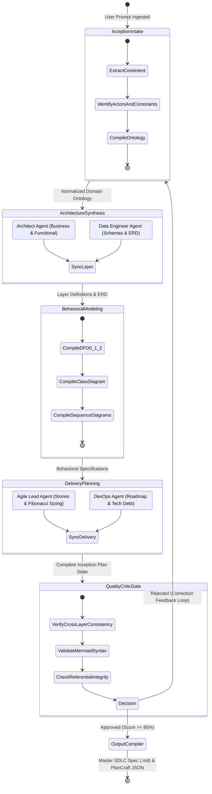
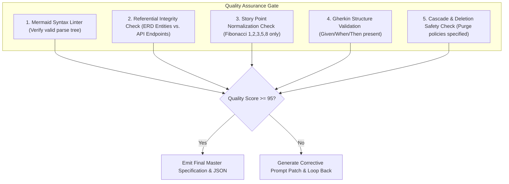

# SDLC Automation 01: Multi-Agent Pipeline Architecture

## Executive Summary
This document specifies the technical architecture of the **Autonomous SDLC Inception Engine (ASIE)**. It defines the multi-agent topology, agent role contracts, state graph transitions, shared working memory models, and reflection/critique feedback loops necessary to transform a conversational idea into a complete SDLC architecture.

---

## 1. Multi-Agent Execution Topology

Software system planning is intrinsically multi-disciplinary: a database administrator reasons differently from an Agile Scrum master, who reasons differently from a cloud security architect. To prevent cognitive collapse and hallucinations in a single LLM prompt, ASIE partitions system inception into **specialized agent personas** coordinated across a directed acyclic state graph with conditional feedback cycles:



---

## 2. Agent Role Decomposition & Responsibilities

| Agent Persona | Primary Responsibilities | Input Context | Emitted Artifacts |
| :--- | :--- | :--- | :--- |
| **1. Domain Discovery Agent** | - Extracts problem statement and business value.<br>- Identifies human and external system actors.<br>- Maps business boundary constraints and non-functional requirements (NFRs). | Raw user conversational prompt | `DomainOntology` JSON (Actors, boundaries, domain terms, NFRs) |
| **2. Enterprise Architect Agent** | - Establishes target technology stack.<br>- Formulates business domain invariants and policies.<br>- Designs Functional REST API endpoints with HTTP verbs, access guards, and schemas. | `DomainOntology` | `LayeredArchitecture` JSON (Business layer rules, Functional endpoints, Middleware pipeline) |
| **3. Data & Schema Engineer Agent** | - Selects persistence technology (Relational, Document, Graph).<br>- Deconstructs domain entities into fields, types, constraints, and keys.<br>- Synthesizes valid Mermaid Crow's Foot ERD syntax. | `DomainOntology`, `LayeredArchitecture` | `ErdSpecification` JSON (Entities array, Data dictionary, Mermaid ERD code) |
| **4. Behavioral Flow Modeler Agent** | - Deconstructs data flows into DFD Level 0, 1, and 2.<br>- Synthesizes UML Class diagrams capturing classes, methods, and relationships.<br>- Generates chronological UML Event Sequence diagrams. | `LayeredArchitecture`, `ErdSpecification` | `DiagramSuite` JSON (Mermaid DFD, Class, Sequence code) |
| **5. Agile Scrum & Sizing Lead Agent** | - Decomposes features into structured Epics.<br>- Drafts user stories in standard `As a... I want... So that...` syntax.<br>- Sizes complexity using the Fibonacci sequence (1, 2, 3, 5, 8).<br>- Generates Gherkin `Given/When/Then` acceptance criteria. | `LayeredArchitecture`, `DiagramSuite` | `AgileBacklog` JSON (Stories array, MoSCoW priorities, Velocity metrics) |
| **6. DevOps & Evolution Strategist Agent** | - Conducts technical debt risk assessment.<br>- Synthesizes 3 strategic growth horizons (Horizon 1: 0-3m, Horizon 2: 3-6m, Horizon 3: 6-12m).<br>- Outlines enterprise microservices decomposition target state. | `LayeredArchitecture`, `DiagramSuite` | `RoadmapSpecification` JSON (Horizons matrix, Tech debt catalog, Gantt diagram) |
| **7. Quality Gate & Consistency Critic Agent** | - Verifies cross-layer integrity (e.g., every entity in ERD has CRUD endpoints in Functional Layer).<br>- Executes syntax validation on all generated Mermaid diagrams.<br>- Flags ambiguities, orphan records, or estimation inconsistencies. | Entire aggregated planning state | `AuditReport` JSON (Approved: Boolean, QualityScore: 0-100, CritiqueFeedback: []) |

---

## 3. Shared Working State Model (StateGraph Memory)

To allow seamless communication between agents, the pipeline maintains a centralized, immutable state tree. Each agent acts as a state transformer:

```json
{
  "session_id": "asie_session_9482",
  "source_prompt": "string",
  "project_metadata": {
    "name": "string",
    "version": "string",
    "description": "string",
    "target_stack": {
      "frontend": "string",
      "backend": "string",
      "database": "string",
      "external": "string"
    }
  },
  "ontology": {
    "actors": [],
    "domain_entities": [],
    "constraints": []
  },
  "architecture": {
    "business_layer": [],
    "data_layer": [],
    "functional_layer": []
  },
  "erd": {
    "entities": [],
    "mermaid_syntax": "string"
  },
  "diagrams": {
    "dfd_level_0": "string",
    "dfd_level_1": "string",
    "class_diagram": "string",
    "sequence_diagrams": []
  },
  "backlog": {
    "total_points": 0,
    "stories": []
  },
  "roadmap": {
    "technical_debt": [],
    "horizons": []
  },
  "audit": {
    "quality_score": 100,
    "issues_detected": [],
    "iteration_count": 1
  }
}
```

---

## 4. Reflection, Self-Correction & Quality Gates

The critic agent executes automated linting and semantic verification passes before any deliverable is finalized:



### Self-Correction Retry Mechanism
If a Mermaid diagram fails syntax validation (for example, containing unquoted parentheses in node labels `id[User (Guest)]` instead of `id["User (Guest)"]`), the critic isolates the offending snippet, generates a targeted correction instruction, and re-invokes the Behavioral Flow Modeler with temperature `0.0`. Maximum retry threshold is capped at 3 iterations.
