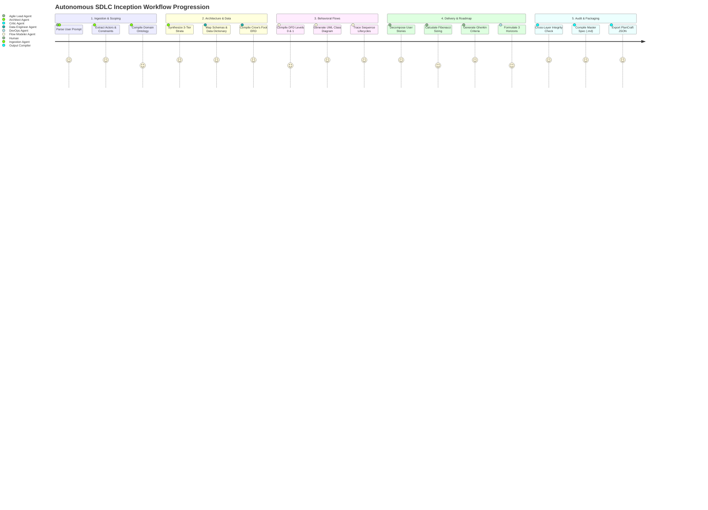

# SDLC Automation 02: Stage-by-Stage Inception Workflow

## Executive Summary
This document delineates the sequential, stage-by-stage operational workflow executed by the **Autonomous SDLC Inception Engine (ASIE)**. It details each stage's objective, transformation logic, heuristic algorithms (including the mathematical formulation of Story Point estimation), input/output dependencies, and validation criteria.

---

## 1. End-to-End Stage Progression Matrix



---

## 2. Comprehensive Stage Breakdown

### Stage 1: Intent Extraction & Boundary Scoping
- **Objective**: Translate raw conversational input into an unambiguous, structured domain definition.
- **Transformation Steps**:
  1. **Entity Extraction**: Identify core business nouns (e.g., in a car rental app: `Vehicle`, `RentalBooking`, `Customer`, `InspectionReport`).
  2. **Actor Categorization**: Distinguish between Human Primary Actors (e.g., `Renter`, `FleetManager`), Human Secondary Actors (e.g., `SupportAgent`), and Automated/External Systems (e.g., `StripeGateway`, `TelematicsGPS`, `DVLA_API`).
  3. **Boundary Invariants**: Delineate what is inside system boundaries vs. external dependencies.
  4. **Non-Functional Requirements (NFRs)**: Automatically extract throughput (RPS), compliance standards (GDPR, PCI-DSS, HIPAA), and latency SLAs.
- **Output Artifact**: `DomainOntology` object.

---

### Stage 2: Multi-Tier Architectural Synthesis
- **Objective**: Establish the multi-tier separation of concerns across the three foundational layers:
  1. **Business Layer (Domain Rules & Invariants)**:
     - Formulate explicit domain validation rules (e.g. uniqueness, credential hashing, state invariants).
     - Define authorization rules (e.g. JWT claims, ownership assertion checks).
     - Formulate cascading lifecycle rules (e.g. cascading deletes, orphaned subdocument cleanup).
  2. **Data Layer (Persistence Strategy)**:
     - Select database paradigm (Relational SQL vs. Document NoSQL vs. Key-Value vs. Graph).
     - Define collections/tables, partition keys, shard keys, and secondary indexing topologies.
  3. **Functional Layer (API Contracts & Middleware)**:
     - Formulate RESTful API endpoint catalog across resources.
     - Specify HTTP Verb (`GET`, `POST`, `PUT`, `DELETE`), URL path with parameters, access tier (`Public`, `Private`, `Admin`), and functional responsibilities.
     - Map the HTTP middleware pipeline (Body parsing $\to$ Authentication $\to$ Validation $\to$ Controller).
- **Output Artifact**: `LayeredArchitecture` object.

---

### Stage 3: Data Modeling & ERD Generation
- **Objective**: Synthesize a formal Entity-Relationship Model, complete Data Dictionary, and compilable Mermaid Crow's Foot ERD code.
- **Transformation Steps**:
  1. **Field Decomposition**: For every identified domain entity, derive required attributes, data types (`UUID`, `String`, `Integer`, `Date`, `Boolean`, `Array`), and nullability.
  2. **Key Assignment**: Designate Primary Keys (`PK`), Foreign Keys (`FK`), and Unique Keys (`UK`).
  3. **Relationship Multiplicity**: Determine cardinality between all entity pairs:
     - Exactly One to One: `||--||`
     - Exactly One to Zero or One: `||--o|`
     - Exactly One to Many: `||--|{`
     - Exactly One to Zero or Many: `||--o{`
  4. **Mermaid ERD Code Generation**: Render strict `erDiagram` syntax.
- **Output Artifact**: `ErdSpecification` object containing the entity array, data dictionary tables, and Mermaid ERD syntax.

---

### Stage 4: Behavioral & Structural Flow Compilation
- **Objective**: Model the dynamic and static behavior of the application through standard UML representations:
  1. **Data Flow Diagrams (DFD)**:
     - **DFD Level 0 (Context)**: Depicts external human and system entities sending/receiving data across the single black-box system boundary.
     - **DFD Level 1 (Functional Decomposition)**: Breaks system into numbered core subsystems (e.g., `1.0 Auth`, `2.0 Inventory`, `3.0 Booking`) and data store interactions.
     - **DFD Level 2 (Detailed Flow)**: Isolates high-risk transaction loops (e.g., checkout payment & inventory locking).
  2. **UML Class Diagram**:
     - Captures models, services, controllers, and store classes with typed properties (`+String email`, `+ObjectId _id`) and public methods (`+save()`, `+findById()`).
  3. **Event Sequence Diagrams**:
     - Chronologically traces message exchanges across Client, Router, Middleware, Controller, Database, and External APIs for critical workflows (e.g., Onboarding, Core Transaction, Cascade Deletion).
- **Output Artifact**: `DiagramSuite` object.

---

### Stage 5: Agile User Story Decomposition & Fibonacci Sizing
- **Objective**: Translate functional capabilities into an actionable, sized development backlog.
- **Story Decomposition Heuristic**:
  - Stories must satisfy the **INVEST** criteria (Independent, Negotiable, Valuable, Estimable, Small, Testable).
  - Every story must follow the canonical syntax:
    $$\text{"As a } \langle \text{Role} \rangle, \text{ I want } \langle \text{Action} \rangle, \text{ So that } \langle \text{Benefit} \rangle"$$
- **Fibonacci Point Sizing Formula**:
  Story points ($SP$) are computed algorithmically based on three weighted dimensions:
  $$SP = \text{NearestFibonacci}\Big( w_e \cdot E + w_c \cdot C + w_r \cdot R \Big)$$
  Where:
  - $E \in [1, 5]$: **Effort** (volume of UI, endpoints, and database mutations required).
  - $C \in [1, 5]$: **Technical Complexity** (concurrency, idempotency, cryptography, external SDKs).
  - $R \in [1, 5]$: **Risk & Uncertainty** (third-party rate limits, data loss vulnerability, new patterns).
  - Weights: $w_e = 0.4$, $w_c = 0.4$, $w_r = 0.2$.
  - Sized strictly using Fibonacci numbers: **1, 2, 3, 5, 8, 13**.
- **Gherkin Acceptance Criteria**:
  Every user story must contain structured Gherkin scenarios:
  ```gherkin
  Scenario: <Descriptive test case>
    Given <Pre-conditions>
    When <Action taken by user>
    Then <Observable result and state change>
    And <Secondary invariant verification>
  ```
- **MoSCoW Prioritization**: Stories are partitioned into **Must Have**, **Should Have**, **Could Have**, and **Won't Have Now**.
- **Output Artifact**: `AgileBacklog` object.

---

### Stage 6: Strategic Roadmap & Technical Debt Forecasting
- **Objective**: Formulate a realistic evolution trajectory beyond the initial MVP.
- **Components**:
  1. **Technical Debt Risk Catalog**: Identifies architectural shortcuts inherent to early-stage delivery (e.g., unpaginated queries, in-memory caches, monolithic process boundaries) with specific remediation tactics.
  2. **Three Horizons Matrix**:
     - **Horizon 1 (0–3 Months - Operational Hardening)**: Security headers, rate limiting, refresh tokens, keyset pagination.
     - **Horizon 2 (3–6 Months - Scale & Real-Time)**: WebSockets notifications, distributed Redis caching, full-text search.
     - **Horizon 3 (6–12 Months - Enterprise Evolution)**: Microservices decomposition, Kafka event streaming, AI recommendation models.
- **Output Artifact**: `RoadmapSpecification` object.
