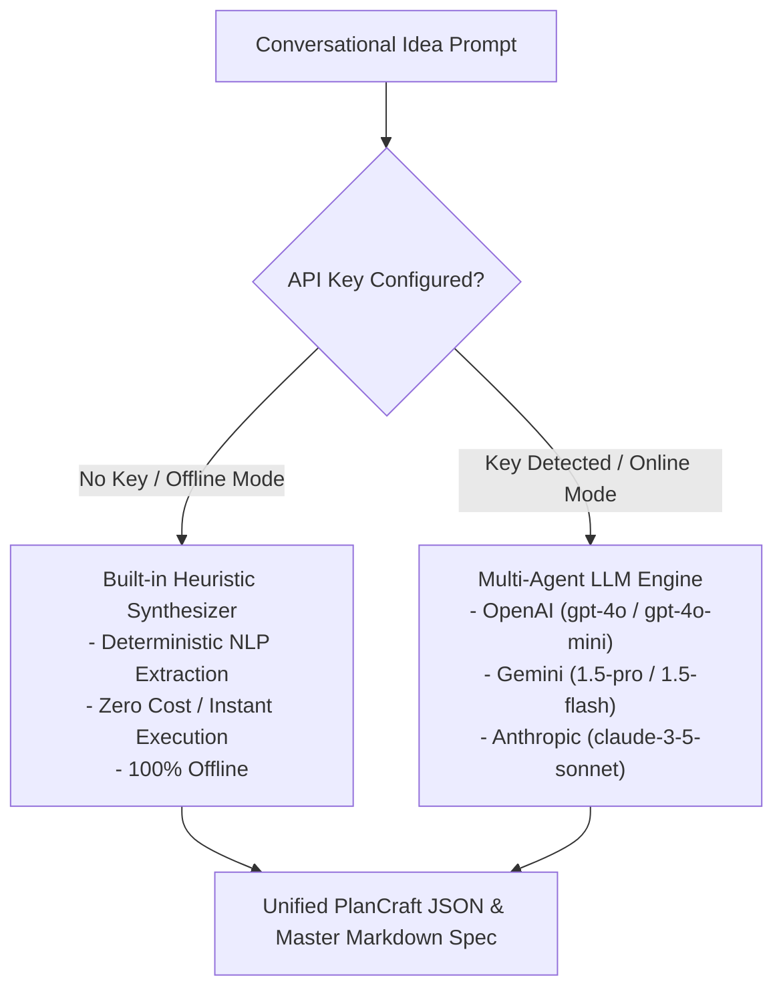

# ASIE Configuration & API Keys Reference Guide
## Everything Required to Transform a Conversational Prompt into an Enterprise System

---

## 1. Overview of Required & Optional Keys

The **Autonomous SDLC Inception Engine (ASIE)** features a **dual-engine execution model**:
1. **Zero-Key Offline Engine (Default)**: Runs immediately with **no API keys, no external network calls, and $0 cost** using built-in intelligent domain heuristic synthesizers.
2. **LLM Provider Engine (AI-Powered)**: Connects to your choice of leading AI models (OpenAI, Google Gemini, Anthropic) for unbounded semantic creativity and custom domain generation.



---

## 2. LLM Provider API Key Options & Setup

You only need **one** of the following LLM providers if you wish to run in AI-powered mode:

| Provider | Recommended Model | Best For | Typical Cost / Run | Where to Obtain Key |
| :--- | :--- | :--- | :---: | :--- |
| **OpenAI** | `gpt-4o` or `gpt-4o-mini` | High adherence to typed JSON schemas and Mermaid syntax | ~$0.08 (`gpt-4o`)<br>~$0.01 (`gpt-4o-mini`) | [platform.openai.com/api-keys](https://platform.openai.com/api-keys) |
| **Google Gemini** | `gemini-1.5-pro` or `gemini-1.5-flash` | Large context window and rapid multi-turn synthesis | Free tier / ~$0.02 | [aistudio.google.com](https://aistudio.google.com/) |
| **Anthropic** | `claude-3-5-sonnet` | Complex architectural logic and nuanced domain policies | ~$0.12 | [console.anthropic.com](https://console.anthropic.com/) |

### Method A: Configure via `.env` File (Recommended)
1. In `d:\Documents\_MyStuff\Projects\fullstack_learning\sdlc-automation\`, copy `.env.example` to `.env`:
   ```bash
   cp .env.example .env
   ```
2. Open `.env` and paste your key:
   ```dotenv
   OPENAI_API_KEY=sk-proj-yourActualKeyHere1234567890
   OPENAI_MODEL=gpt-4o
   ```

### Method B: Set Environment Variable in PowerShell / Windows
If you prefer not to create a file on disk:
```powershell
# Set for current PowerShell session:
$env:OPENAI_API_KEY = "sk-proj-yourActualKeyHere"

# Or set globally for your user account:
[System.Environment]::SetEnvironmentVariable('OPENAI_API_KEY', 'sk-proj-yourActualKeyHere', 'User')
```

### Method C: Pass Directly via CLI Arguments
```powershell
node src/cli.js --idea "Drone grocery delivery" --provider openai --key "sk-proj-yourKey"
```

### Method D: Pass in Interactive Browser UI
Open [`src/interactive_runner.html`](file:///d:/Documents/_MyStuff/Projects/fullstack_learning/sdlc-automation/src/interactive_runner.html) directly in your browser. Enter your API key into the secure UI input field (keys remain strictly in your local browser memory and are never transmitted to third parties).

---

## 3. Token Usage & Cost Breakdown

An end-to-end SDLC inception run executes 6 distinct synthesis stages plus cross-layer validation:

| Pipeline Stage | Avg Input Tokens | Avg Output Tokens | What is Being Generated |
| :--- | :---: | :---: | :--- |
| **Stage 1: Domain Ontology** | ~1,200 | ~800 | Actors, domain entities, boundary limits, NFRs |
| **Stage 2: Layered Architecture** | ~2,500 | ~1,800 | Business rules, Data collections, Functional REST catalog |
| **Stage 3: Data Modeling & ERD** | ~3,000 | ~2,200 | Physical Data Dictionary + Crow's Foot Mermaid ERD code |
| **Stage 4: Behavioral & Structural Flows** | ~3,500 | ~2,500 | DFD Level 0, DFD Level 1, UML Class, Event Sequence |
| **Stage 5: Agile Stories & Points** | ~4,000 | ~3,200 | 15–25 User Stories, Fibonacci sizing, Gherkin criteria |
| **Stage 6: Strategic Roadmap** | ~2,500 | ~1,200 | Horizons 1/2/3 matrix + Technical Debt catalog |
| **Critic Validation Pass** | ~3,000 | ~500 | Quality audit score and consistency verification |
| **TOTALS** | **~19,700 tokens** | **~12,200 tokens** | **Complete Master Specification Suite** |

- **Using `gpt-4o-mini` or `gemini-1.5-flash`**: Under **$0.02 USD** per complete system specification.
- **Using `gpt-4o`**: Approximately **$0.12 - $0.20 USD** per complete system specification.
- **Using Built-in Heuristic Engine**: **$0.00 USD (Completely Free)**.

---

## 4. Optional Third-Party Project Management Keys

If you want ASIE to automatically publish the generated user stories and diagrams to your team's issue tracker:

### 4.1 Linear Integration (GraphQL)
- **Environment Variables**:
  ```dotenv
  LINEAR_API_KEY=lin_api_xxxxxxxxxxxxxxxx
  LINEAR_TEAM_ID=xxxxxxxx-xxxx-xxxx-xxxx-xxxxxxxxxxxx
  ```
- **Where to obtain**: Linear Settings $\to$ Security & Access $\to$ Personal API Keys.
- **Permissions**: `write` access to issues.

### 4.2 Atlassian Jira Integration (REST API v3)
- **Environment Variables**:
  ```dotenv
  JIRA_HOST=https://your-domain.atlassian.net
  JIRA_EMAIL=your.email@company.com
  JIRA_API_TOKEN=your_jira_api_token_here
  JIRA_PROJECT_KEY=DEV
  ```
- **Where to obtain**: Atlassian Account Settings $\to$ Security $\to$ Create and manage API tokens.

### 4.3 GitHub Integration (CI/CD Pipeline)
- **Environment Variable**: `GITHUB_TOKEN`
- **Where to obtain**: GitHub Settings $\to$ Developer Settings $\to$ Personal Access Tokens (Classic or Fine-grained) with `repo` scope.
- **Purpose**: Enables the automated GitHub Actions workflow to commit generated markdown documents into your repository automatically.

---

## 5. Security Best Practices

1. **Never commit `.env` to version control**: The `.gitignore` in the repository root already protects `.env` files.
2. **Use read-only / scoped keys**: When setting up CI/CD bots, restrict the API key's scope to model completions only.
3. **Local Storage in Browser**: The browser runner (`src/interactive_runner.html`) stores your key in `sessionStorage` or local memory, never sending it anywhere other than direct HTTPS requests to the official provider endpoint (`api.openai.com` or `generativelanguage.googleapis.com`).
