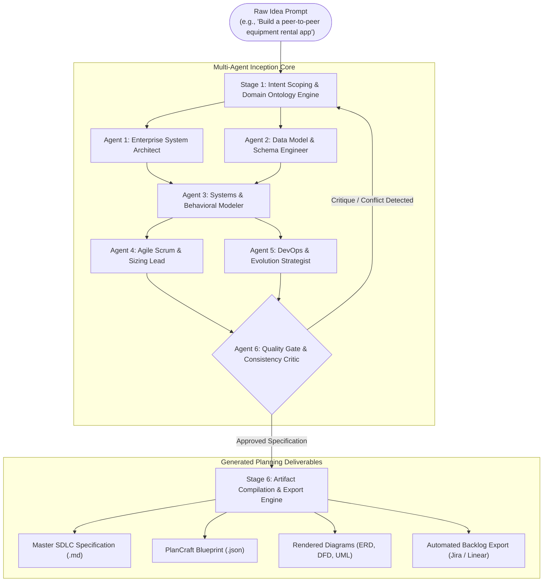

# Autonomous SDLC Inception Engine (ASIE)
## End-to-End Automation of the Software Inception & Planning Stage

---

## Executive Overview

The **Autonomous SDLC Inception Engine (ASIE)** is an automated, agentic pipeline designed to transform a raw, informal software idea expressed in a natural-language conversation (e.g. *"I want to build an on-demand drone delivery service for suburban groceries"*) into an **exhaustive, production-ready SDLC Planning & Architecture Specification Suite**.

By replacing weeks of manual whiteboard sessions, requirements gathering meetings, and ad-hoc diagram drafting, ASIE structures software planning into a deterministic, multi-agent synthesis process yielding:
1. **Multi-Tier Layered Architecture** (Business Rules, Data Schemas, Functional REST Contracts).
2. **Entity-Relationship Model & Data Dictionary** (Crow's Foot Mermaid ERDs, field types, constraints, and keys).
3. **Behavioral & Structural UML Flows** (DFD Level 0/1/2, UML Class diagrams, and Event Sequence diagrams).
4. **Agile Backlog with Fibonacci Story Points** (Categorized Epics, MoSCoW priorities, and Gherkin `Given/When/Then` acceptance criteria).
5. **Post-MVP Growth Roadmap** (Horizons 1/2/3 and Technical Debt assessment).
6. **Executable Blueprint JSON** for instant loading into the [PlanCraft SDLC Studio](file:///d:/Documents/_MyStuff/Projects/fullstack_learning/sdlc-planner/index.html).

---

## Pipeline Architecture at a Glance

---

## Documentation Index

This directory provides the complete blueprint, workflow specifications, and prompt contracts required to build and deploy this automated inception engine:

| Document | Purpose & Content |
| :--- | :--- |
| **[01_PIPELINE_ARCHITECTURE.md](file:///d:/Documents/_MyStuff/Projects/fullstack_learning/sdlc-automation/01_PIPELINE_ARCHITECTURE.md)** | Multi-agent execution topology, role decomposition, state graph transitions, and memory management. |
| **[02_STAGE_BY_STAGE_WORKFLOW.md](file:///d:/Documents/_MyStuff/Projects/fullstack_learning/sdlc-automation/02_STAGE_BY_STAGE_WORKFLOW.md)** | Step-by-step breakdown of the 6 inception stages, mathematical estimation models, and validation gates. |
| **[03_PROMPT_CHAINING_AND_SCHEMAS.md](file:///d:/Documents/_MyStuff/Projects/fullstack_learning/sdlc-automation/03_PROMPT_CHAINING_AND_SCHEMAS.md)** | Production system prompts, Few-Shot examples, and Pydantic/JSON Schema contracts for type-safe execution. |
| **[04_TOOLING_AND_INTEGRATION_GUIDE.md](file:///d:/Documents/_MyStuff/Projects/fullstack_learning/sdlc-automation/04_TOOLING_AND_INTEGRATION_GUIDE.md)** | Tool interfaces for Mermaid CLI compilation, GitHub/GitLab integration, and Jira/Linear GraphQL syncing. |
| **[examples/idea_to_spec_walkthrough.md](file:///d:/Documents/_MyStuff/Projects/fullstack_learning/sdlc-automation/examples/idea_to_spec_walkthrough.md)** | Comprehensive case study showing how a 1-sentence prompt is transformed into a complete enterprise specification. |

---

## Key Technological Principles

1. **Structured Outputs over Free-Form Text**: Every agent emits validated JSON conforming strictly to typed schemas (e.g. Pydantic). Markdown and Mermaid representations are synthesized deterministically from this verified single source of truth.
2. **Cross-Layer Consistency Enforcement**: If the Data Architect defines an entity `INVOICE`, the Agile Scrum Lead must generate user stories referencing `INVOICE`, and the Functional Layer must contain corresponding CRUD endpoints. The Consistency Critic enforces referential integrity across all layers.
3. **Deterministic Diagram Compilation**: Natural language is never converted into visual images directly; it is synthesized into declarative Mermaid code verified through syntactic linter checks.
