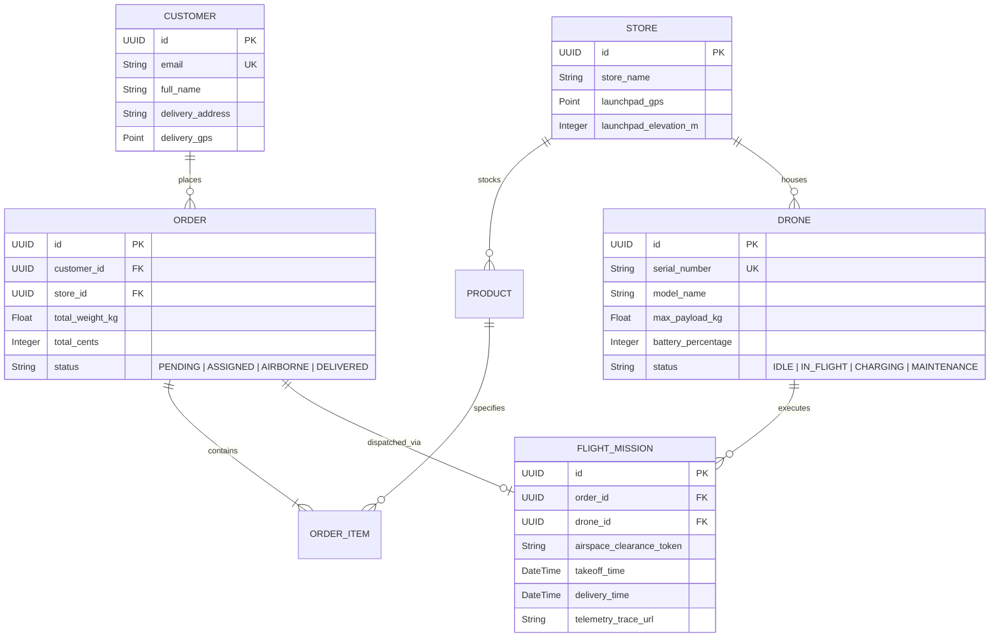
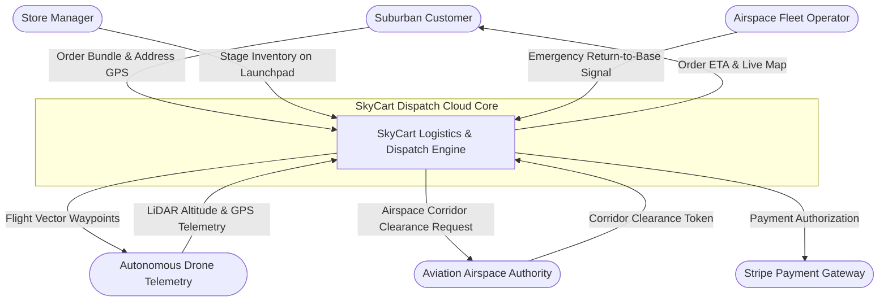
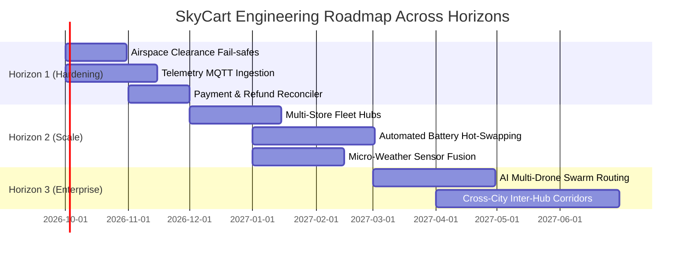

# SDLC Automation Walkthrough: From 1-Sentence Idea to Enterprise Architecture

## Executive Summary
This case study documents an end-to-end execution of the **Autonomous SDLC Inception Engine (ASIE)**. It traces how a single natural-language user prompt is progressively transformed across all six inception stages into a complete, publication-grade SDLC planning specification suite.

---

## 1. The Input Prompt

A product manager inputs the following single-sentence prompt into the conversation:

> **User Prompt**:  
> *"I want to build an on-demand suburban grocery drone delivery dispatch platform called **SkyCart**, where local grocers list inventory, suburban customers order bundles, and autonomous drones are assigned to flight corridors with battery telemetry and real-time package drop-off verification."*

---

## 2. Stage 1: Domain Discovery & Ontology Synthesis

### Agent 1 Execution Output (`ontology.json`)
```json
{
  "project_id": "skycart",
  "project_name": "SkyCart - Autonomous Drone Delivery Dispatch",
  "domain_summary": "On-demand rapid logistics platform dispatching autonomous aerial drones for suburban grocery delivery.",
  "actors": [
    { "name": "Customer", "category": "Human_Primary", "role": "Browses catalog, places delivery orders, receives package" },
    { "name": "StoreManager", "category": "Human_Primary", "role": "Manages local grocery store inventory and stages packages at takeoff pad" },
    { "name": "FleetOperator", "category": "Human_Secondary", "role": "Monitors airspace corridors, drone battery levels, and emergency aborts" },
    { "name": "DroneTelemetryUnit", "category": "External_System", "role": "Streams GPS coords, altitude, velocity, and battery state via MQTT" },
    { "name": "AviationAirspaceAPI", "category": "External_System", "role": "Validates FAA/CAA suburban flight corridor clearance" },
    { "name": "StripePayments", "category": "External_System", "role": "Authorizes and captures customer payments" }
  ],
  "boundary_invariants": [
    "Drones must never be dispatched with battery capacity under 40% plus reserve return margin.",
    "Deliveries are restricted to pre-certified suburban geo-fenced drop-off zones.",
    "Flight paths require active FAA airspace authorization prior to rotor spin-up."
  ]
}
```

---

## 3. Stage 2: Multi-Tier Layered Architecture

### Business Layer Invariants
1. **Battery Reserve & Payload Capacity Invariant**: A drone cannot be assigned to an order if `total_weight_kg > drone.max_payload_kg` or if `flight_distance_km * 2.5 > remaining_battery_range_km`.
2. **Flight Corridor Authorization**: Every takeoff requires an active corridor clearance token issued by `AviationAirspaceAPI` within the last 5 minutes.
3. **Fail-Safe Abort Procedure**: If wind gusts exceed 35 knots or telemetry is lost for >10 seconds, drone transitions to `FAILSAFE_HOVER` and returns to origin pad.

### Data Layer Topology
- Database: **PostgreSQL + PostGIS** (for spatial flight corridor queries) + **Redis** (for real-time drone telemetry caching).
- Collections / Tables: `customers`, `stores`, `products`, `orders`, `drones`, `flight_logs`, `corridors`.

### Functional REST API Contract (Excerpt)
| Method | Path | Access | Description |
| :--- | :--- | :---: | :--- |
| `POST` | `/api/v1/orders` | Private (Customer) | Create delivery order and reserve merchant inventory |
| `POST` | `/api/v1/dispatch/assign` | Private (Fleet) | Assign optimal drone based on payload and battery level |
| `PUT` | `/api/v1/drones/:id/telemetry` | Private (Device) | Ingest high-frequency telemetry ping (GPS, battery, speed) |
| `POST` | `/api/v1/orders/:id/verify-dropoff` | Private (Device) | Submit ultrasonic LiDAR height reading and release cargo |

---

## 4. Stage 3: Data Modeling & Mermaid ERD



---

## 5. Stage 4: Behavioral & Structural Flows

### DFD Level 0 Context Diagram


---

## 6. Stage 5: Agile User Stories with Fibonacci Points

### Sample Story Breakdown

#### US-SKY-01: Autonomous Drone Assignment Engine
- **Statement**: *As a SkyCart fleet operator, I want the dispatch system to automatically match confirmed orders with eligible drones based on payload weight and battery capacity, so that delivery flights operate with 100% safety margins.*
- **Epic**: `DISPATCH`
- **Story Points**: **8** (High Complexity: PostGIS spatial lookup, battery range calculations, payload threshold constraints)
- **Priority**: **Must Have**
- **Acceptance Criteria**:
  ```gherkin
  Scenario: Successful drone allocation
    Given an order weighing 2.2 kg with delivery distance of 4.5 km
    And drone D-101 has payload limit 4.0 kg and battery level 85% (range: 18 km)
    When order dispatch is triggered
    Then drone D-101 is transitioned from IDLE to RESERVED
    And flight corridor clearance request is sent to AviationAirspaceAPI.

  Scenario: Ineligible drone due to low battery reserve
    Given an order requiring 12 km round-trip flight
    And drone D-102 has battery level 42% (safe range: 8 km)
    When dispatch evaluates D-102
    Then D-102 is skipped with reason "INSUFFICIENT_BATTERY_MARGIN"
    And order searches for next eligible idle drone.
  ```

#### US-SKY-02: LiDAR-Verified Cargo Drop-off Release
- **Statement**: *As a suburban customer, I want the drone to verify ground proximity via ultrasonic/LiDAR sensors before releasing package tether, so that groceries are not damaged on impact.*
- **Epic**: `FLIGHT`
- **Story Points**: **5**
- **Priority**: **Must Have**
- **Acceptance Criteria**:
  ```gherkin
  Scenario: Safe ground tether release
    Given drone is hovering at delivery coordinates
    When downward LiDAR reports steady ground altitude of 0.8 meters for 2 seconds
    Then winch release mechanism unlocks
    And order status updates to DELIVERED
    And push notification is sent to customer mobile device.
  ```

---

## 7. Stage 6: Strategic Roadmap & Further Work



---

## 8. Exporting to PlanCraft Studio

The entire case study above is packaged into `skycart_blueprint.json`. In the [PlanCraft SDLC Studio](file:///d:/Documents/_MyStuff/Projects/fullstack_learning/sdlc-planner/index.html), the user clicks **"Import JSON"**, selects `skycart_blueprint.json`, and the entire workbench instantly renders the interactive tabs, live Mermaid diagrams, and editable stories!
