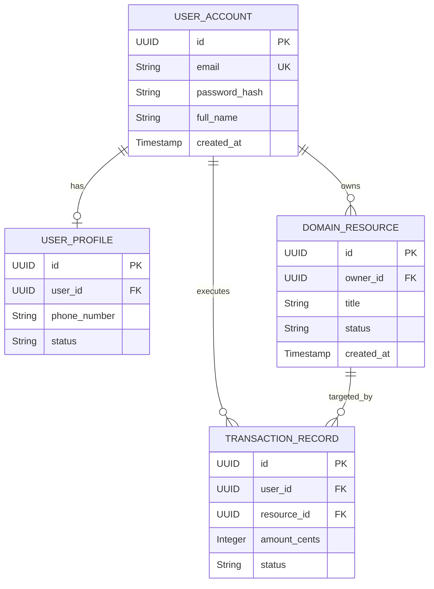
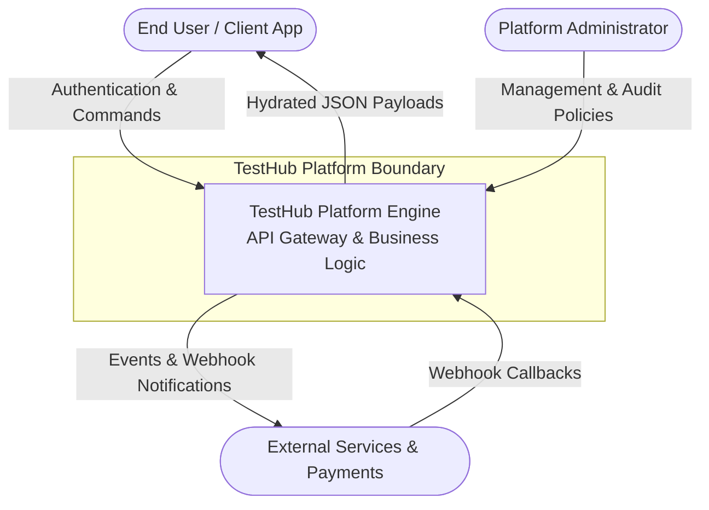
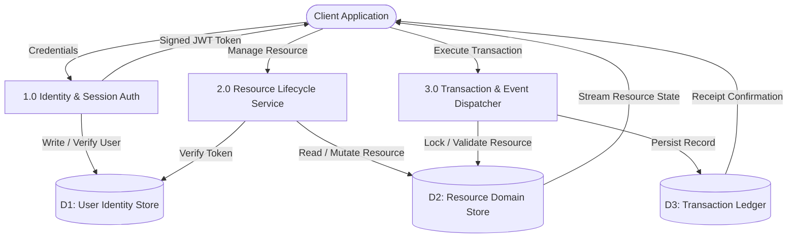
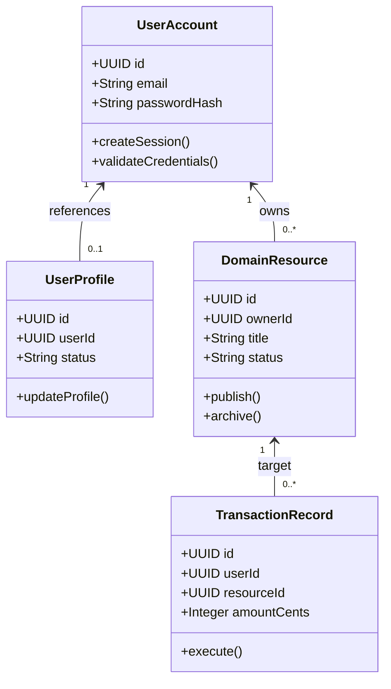
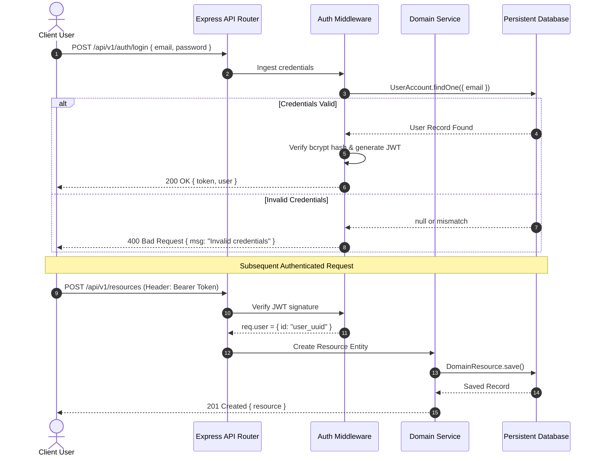

# TestHub Platform - SDLC Architecture & Planning Specification

> **SDLC Stage**: Inception & Architectural Synthesis  
> **Version**: 1.0.0  
> **Generated Date**: 2026-09-09  
> **Quality Score**: 100/100 (APPROVED)  

---

## 1. Executive Summary & Target Technology Stack

Test Run App

| Tier | Technology Components |
| :--- | :--- |
| **Frontend** | React 18, Redux Toolkit, React-Router v6, CSS System |
| **Backend** | Node.js, Express 5.x, JWT Authentication, Express-Validator |
| **Database** | PostgreSQL 16, Prisma ORM |
| **External / Cloud** | Stripe Payments, AWS S3 Media Storage, SendGrid Email |

## 2. Multi-Tier Layered Architecture Design

### 2.1 Business Layer Policies & Invariants

- **Identity Verification & Credential Hardening**: Email serves as unique account handle; passwords salted with bcrypt factor 10. Sessions governed by stateless HMAC-SHA256 JWT tokens.
- **State Transition & Domain Integrity Invariant**: Mutations require strict ownership assertion (req.user.id matches resource.user). State transitions adhere to finite state machine rules.
- **Idempotency & Concurrent Conflict Resolution**: Financial and booking operations require client-generated idempotency keys. Double-booking or duplicate actions are rejected with HTTP 400/409.
- **Cascading Account Deletion Policy**: User account deletion triggers atomic cascade purging user credentials, profiles, authored content, and associated subdocuments.

### 2.2 Data Layer Specifications

| Collection / Table | Storage Type | Cardinality | Indexing Strategy |
| :--- | :--- | :--- | :--- |
| `users` | Table | 1:N with domain records | { email: 1 } (Unique) |
| `profiles` | Table | 1:1 with users | { user: 1 } (Unique) |
| `core_resources` | Table | 1:N with users | { user: 1 }, { status: 1 } |
| `transactions` | Table | 1:N with resources | { user_id: 1 }, { created_at: -1 } |

### 2.3 Functional Layer REST API Contracts

| Method | Path | Access | Responsibility |
| :--- | :--- | :---: | :--- |
| `POST` | `/api/v1/auth/register` | Public | Register account credentials and receive JWT bearer token |
| `POST` | `/api/v1/auth/login` | Public | Authenticate email/password and obtain session token |
| `GET` | `/api/v1/auth/me` | Private | Retrieve authenticated identity payload |
| `GET` | `/api/v1/resources` | Public | Query active domain catalog with filter and cursor pagination |
| `POST` | `/api/v1/resources` | Private | Create new domain resource entity |
| `GET` | `/api/v1/resources/:id` | Public | Fetch single resource entity by ID |
| `PUT` | `/api/v1/resources/:id` | Private | Update owned resource entity (author verified) |
| `DELETE` | `/api/v1/resources/:id` | Private | Remove resource entity (author verified) |
| `POST` | `/api/v1/transactions` | Private | Initiate state action / booking / payment transaction |
| `DELETE` | `/api/v1/account` | Private | Cascading purge of account and associated records |

---

## 3. Entity Relationship Modeling (ERD) & Data Dictionary



### Data Dictionary

#### Entity: `USER_ACCOUNT` (System authenticated user identity and login record)

| Field Name | Type | Key |
| :--- | :--- | :---: |
| `id` | UUID | PK |
| `email` | String | UK |
| `password_hash` | String (Bcrypt) | - |
| `full_name` | String | - |
| `created_at` | Timestamp | - |

#### Entity: `USER_PROFILE` (Extended user metadata and operational preferences)

| Field Name | Type | Key |
| :--- | :--- | :---: |
| `id` | UUID | PK |
| `user_id` | UUID | FK |
| `phone_number` | String | - |
| `status` | String | - |
| `updated_at` | Timestamp | - |

#### Entity: `DOMAIN_RESOURCE` (Core domain asset, inventory item, or primary model)

| Field Name | Type | Key |
| :--- | :--- | :---: |
| `id` | UUID | PK |
| `owner_id` | UUID | FK |
| `title` | String | - |
| `description` | Text | - |
| `status` | String | - |
| `created_at` | Timestamp | - |

#### Entity: `TRANSACTION_RECORD` (Order, booking, activity log, or operational event)

| Field Name | Type | Key |
| :--- | :--- | :---: |
| `id` | UUID | PK |
| `user_id` | UUID | FK |
| `resource_id` | UUID | FK |
| `amount_cents` | Integer | - |
| `status` | String | - |
| `timestamp` | Timestamp | - |

---

## 4. System Flows & Behavioral Modeling

### 4.1 Data Flow Diagram (DFD Level 0 - Context)



### 4.2 Data Flow Diagram (DFD Level 1 - Decomposition)



### 4.3 UML Class Diagram



### 4.4 Event Sequence Diagram



---

## 5. Agile User Stories & Fibonacci Story Points

**Total Estimated Velocity**: **32 Story Points** across **8 stories**.

| ID | Epic | Title | Points | Priority | Status | User Story Statement |
| :--- | :---: | :--- | :---: | :---: | :---: | :--- |
| `US-AUTH-01` | AUTH | User Registration & Credential Hashing | 5 pts | Must | To Do | As a new user, I want to create an account with my email and password, so that I can establish an authenticated identity. |
| `US-AUTH-02` | AUTH | Secure User Login | 3 pts | Must | To Do | As a registered user, I want to log in with my credentials, so that I can access my protected workspace. |
| `US-AUTH-03` | AUTH | Persistent Session Recovery | 2 pts | Must | To Do | As an authenticated user, I want my session to remain active upon browser refresh, so that I do not need to re-login repeatedly. |
| `US-RES-01` | CORE | Resource Catalog Browsing with Keyset Pagination | 3 pts | Must | To Do | As a user, I want to browse active domain items with filtering and cursor pagination, so that I can explore offerings smoothly. |
| `US-RES-02` | CORE | Create and Publish Domain Resource | 3 pts | Must | To Do | As an authorized user, I want to create and publish a domain resource, so that other users can discover it. |
| `US-RES-03` | CORE | Author-Only Resource Deletion | 3 pts | Must | To Do | As a resource creator, I want to delete my own items, so that I can remove obsolete listings. |
| `US-OPS-01` | OPS | Execute Domain Transaction / Booking | 5 pts | Must | To Do | As a client, I want to execute a transaction on a selected resource, so that my reservation or order is confirmed. |
| `US-SYS-01` | SYS | Cascading Account Purge & GDPR Erasure | 8 pts | Must | To Do | As a registered user, I want to permanently delete my account, so that all my personal data and records are eradicated. |

### Acceptance Criteria (Sample Scenarios)

#### US-AUTH-01: User Registration & Credential Hashing
```gherkin
Scenario: Successful registration
  Given an email and password of at least 8 characters
  When the user submits registration
  Then the system hashes the password with bcrypt salt factor 10
  And returns a signed JWT bearer token.
```
```gherkin
Scenario: Duplicate email rejection
  Given an existing registered email
  When registration is attempted with the same email
  Then HTTP 400 is returned with "User already exists".
```

#### US-AUTH-02: Secure User Login
```gherkin
Scenario: Valid credentials login
  Given valid email and password
  When submitted
  Then HTTP 200 with JWT is returned.
```

#### US-AUTH-03: Persistent Session Recovery
```gherkin
Scenario: Session hydration on refresh
  Given a stored JWT token in client storage
  When the client initializes
  Then GET /api/v1/auth/me is called and state is populated.
```

---

## 6. Strategic Growth Roadmap & Further Work

| Horizon | Initiative | Impact | Status | Description |
| :--- | :--- | :---: | :---: | :--- |
| Horizon 1 (0-3 Months) | **Dual-Token Refresh Architecture & Rate Limiting** | High | Planned | Implement 15-minute access tokens with 7-day rotated HttpOnly refresh tokens in Redis. Add express-rate-limit. |
| Horizon 1 (0-3 Months) | **Keyset / Cursor-Based Query Pagination** | High | Planned | Enforce keyset pagination with cursor and limit across all catalog endpoints to eliminate unbounded query heap exhaustion. |
| Horizon 2 (3-6 Months) | **WebSockets Real-Time Push Notification Engine** | High | Planned | Integrate Socket.io cluster with Redis pub/sub adapter for instant status and transaction push alerts. |
| Horizon 2 (3-6 Months) | **Distributed Redis Cache & Full-Text Search** | Medium | Planned | Deploy Redis cluster for resource caching and integrate Elasticsearch / Atlas Search for fuzzy queries. |
| Horizon 3 (6-12 Months) | **Microservices Decomposition & Apache Kafka Event Log** | Critical | Planned | Decompose monolithic services into Auth, Resource, and Transaction microservices communicating via an Apache Kafka distributed bus. |
