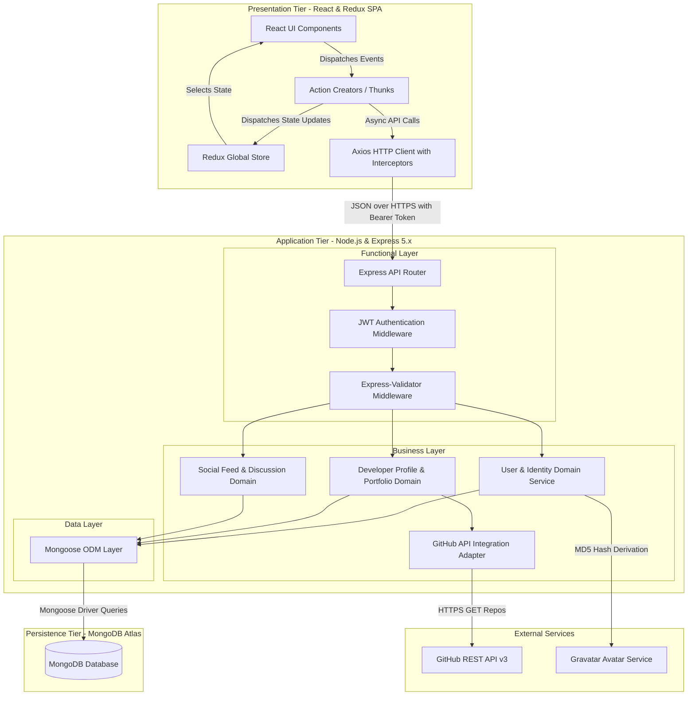
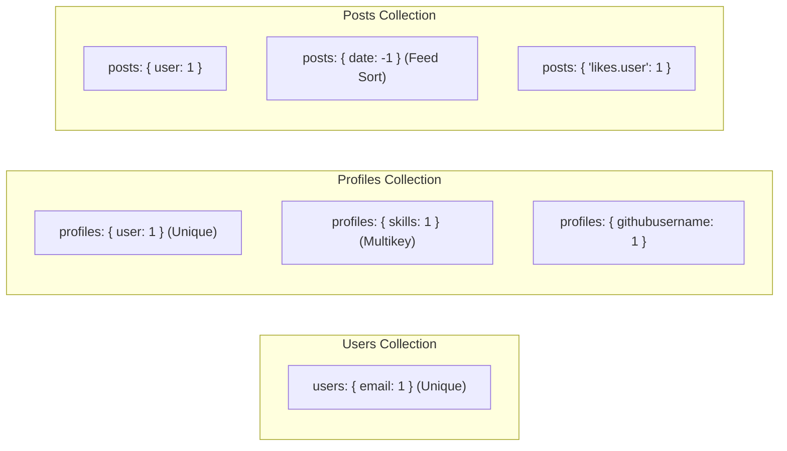
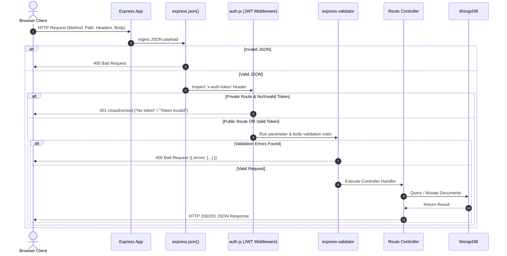

# SDLC Planning Artifact 01: Layered Architecture Design

## Executive Summary
This document specifies the multi-tier architectural decomposition for the **DevConnector** platform, a social networking and portfolio platform tailored for software developers. The architecture follows a classical three-tier separation of concerns:
1. **Business Layer (Domain Logic & Governance)**
2. **Data Layer (Persistence, Schemas & Integrity)**
3. **Functional Layer (Application Services, API Gateway & Client State)**

---

## 1. High-Level Architectural Decomposition

The system is structured into cleanly decoupled architectural strata:



---

## 2. Business Layer Design

The Business Layer encapsulates all domain entities, validation invariants, authorization constraints, and core computational rules.

### 2.1 Identity & Authentication Domain Rules
- **Account Uniqueness**: An email address uniquely identifies a developer identity. Duplicate registration attempts must be rejected with HTTP 400 (`User already exists`).
- **Password Invariant & Security**:
  - Raw passwords must be at least 6 characters in length.
  - Passwords must be hashed using `bcryptjs` with a salt cost factor of `10` before persisting.
  - Plaintext passwords must never be stored, logged, or returned in API responses.
- **Avatar Derivation**:
  - If no custom avatar is provided, user avatars are automatically derived from the MD5 hash of their lowercased email address using Gravatar's protocol (`size: 200px`, `rating: pg`, `default: mm`).
- **Session & Token Authorization**:
  - Stateless authentication relies on JSON Web Tokens (JWT).
  - Tokens are signed with a server-side secret (`jwtSecret`) using HMAC-SHA256.
  - Payload contains `{ user: { id: ObjectId } }`.
  - Token expiration is configured to 360,000 seconds (100 hours) during development, with production hardening required for short-lived access tokens.

### 2.2 Profile & Portfolio Domain Rules
- **1:1 User-to-Profile Cardinality**: Each registered user may possess at most one professional profile.
- **Mandatory Profile Fields**: A developer profile must specify a current professional `status` (e.g., "Senior Developer", "Student", "Junior Developer") and at least one technical `skill`.
- **Skill Normalization**: Skills are ingested as a comma-delimited string and normalized into a trimmed array of lowercase/case-preserved strings.
- **Career Timeline Invariants**:
  - Experience and education records require a valid `from` date.
  - If `current` is `true`, the `to` date may be null/omitted. If `current` is `false`, `to` must be equal to or greater than `from`.
- **GitHub Integration**:
  - Developer profiles with a populated `githubusername` attribute dynamically query GitHub's public API (`https://api.github.com/users/:username/repos?per_page=5&sort=created:asc`).
  - GitHub client ID and secret are passed as query parameters to increase GitHub rate-limit quota from 60 to 5,000 requests/hour.

### 2.3 Social Interaction & Community Governance Rules
- **Post Authoring**:
  - Only authenticated users may author posts.
  - Posts require a non-empty `text` body.
  - The author's display name and avatar snapshot are captured at post creation for denormalized query performance.
- **Idempotent Like/Unlike Lifecycle**:
  - A user may like a specific post at most once.
  - Attempting to like an already-liked post returns HTTP 400 (`Post already liked`).
  - Unliking a post removes the user's ID from the `likes` array. Attempting to unlike a post that was not liked returns HTTP 400 (`Post not liked yet`).
- **Comment Moderation & Ownership**:
  - Comments are stored directly inside the post's embedded comments array.
  - Only the author of a comment is authorized to delete their comment. An attempt by a non-author to delete a comment returns HTTP 401 (`User not authorised`).
- **Post Deletion Authority**:
  - Only the original post author is authorized to delete a post.
  - Non-owner deletion attempts result in HTTP 401 (`User not authorised`).
- **Cascading Account Deletion**:
  - When an authenticated user deletes their account (`DELETE /api/profile`), the system must atomically or sequentially delete:
    1. All posts authored by the user (`Post.deleteMany({ user: req.user.id })`).
    2. The developer's profile (`Profile.findOneAndDelete({ user: req.user.id })`).
    3. The user authentication credential entity (`User.findOneAndDelete({ _id: req.user.id })`).

---

## 3. Data Layer Design

The Data Layer is built upon MongoDB using Mongoose as the Object Data Modeling (ODM) framework.

### 3.1 Document vs. Relational Storage Evaluation

| Architectural Factor | Selected Approach (MongoDB / Mongoose) | Alternative (PostgreSQL / Relational) | Architectural Rationale |
| :--- | :--- | :--- | :--- |
| **Schema Flexibility** | Dynamic JSON document schema | Rigid tabular schema with migrations | Developer profiles have polymorphic structures (varying social links, arbitrary skills, optional fields). |
| **Nested Collections** | Embedded subdocument arrays (`experience`, `education`, `comments`, `likes`) | Normalized join tables (`user_experiences`, `user_educations`, `post_comments`) | Reading a complete profile or post discussion thread requires a single atomic read operation without expensive multi-table JOINs. |
| **Horizontal Scalability** | Native sharding support across document collections | Sharding requires complex foreign key partitioning | Social feeds and posts can scale horizontally through hash-based sharding on `_id` or `user`. |
| **Write Performance** | Atomic subdocument modifications (`$push`, `$pull`, `$addToSet`) | Multi-row transactional inserts | Single-document atomicity in MongoDB satisfies DevConnector's like and comment updates with minimal locking overhead. |

### 3.2 Collection Schemas & Data Constraints

#### `users` Collection Schema
```javascript
{
  _id: ObjectId,
  name: { type: String, required: true, trim: true },
  email: { type: String, required: true, unique: true, lowercase: true, index: true },
  password: { type: String, required: true },
  avatar: { type: String },
  date: { type: Date, default: Date.now }
}
```

#### `profiles` Collection Schema
```javascript
{
  _id: ObjectId,
  user: { type: ObjectId, ref: 'user', required: true, unique: true, index: true },
  company: { type: String },
  website: { type: String },
  location: { type: String },
  status: { type: String, required: true },
  skills: { type: [String], required: true, index: true },
  bio: { type: String },
  githubusername: { type: String, index: true },
  experience: [
    {
      _id: ObjectId,
      title: { type: String, required: true },
      company: { type: String, required: true },
      location: { type: String },
      from: { type: Date, required: true },
      to: { type: Date },
      current: { type: Boolean, default: false },
      description: { type: String }
    }
  ],
  education: [
    {
      _id: ObjectId,
      school: { type: String, required: true },
      degree: { type: String, required: true },
      fieldofstudy: { type: String, required: true },
      from: { type: Date, required: true },
      to: { type: Date },
      current: { type: Boolean, default: false },
      description: { type: String }
    }
  ],
  social: {
    youtube: { type: String },
    twitter: { type: String },
    facebook: { type: String },
    linkedin: { type: String },
    instagram: { type: String }
  },
  date: { type: Date, default: Date.now }
}
```

#### `posts` Collection Schema
```javascript
{
  _id: ObjectId,
  user: { type: ObjectId, ref: 'users', required: true, index: true },
  text: { type: String, required: true },
  name: { type: String },
  avatar: { type: String },
  likes: [
    {
      _id: ObjectId,
      user: { type: ObjectId, ref: 'users', required: true }
    }
  ],
  comments: [
    {
      _id: ObjectId,
      user: { type: ObjectId, ref: 'users', required: true },
      text: { type: String, required: true },
      name: { type: String },
      avatar: { type: String },
      date: { type: Date, default: Date.now }
    }
  ],
  date: { type: Date, default: Date.now, index: -1 }
}
```

### 3.3 Indexing Strategy



---

## 4. Functional Layer Design

The Functional Layer encompasses the API endpoints, HTTP middleware pipeline, input validation, and client-side application state management.

### 4.1 Middleware Processing Pipeline

Every incoming HTTP request undergoes sequential pipeline processing before reaching controller logic:



### 4.2 Comprehensive REST API Contract Matrix

| Domain | Method | Endpoint | Access | Required Payload / Params | Success Status | Error Codes |
| :--- | :--- | :--- | :--- | :--- | :--- | :--- |
| **Auth** | `GET` | `/api/auth` | Private | Header: `x-auth-token` | 200 OK (`User` object without password) | 401, 500 |
| **Auth** | `POST` | `/api/auth` | Public | `{ email, password }` | 200 OK (`{ token }`) | 400, 500 |
| **Users** | `POST` | `/api/users` | Public | `{ name, email, password }` | 200 OK (`{ token }`) | 400, 500 |
| **Profile** | `GET` | `/api/profile/me` | Private | Header: `x-auth-token` | 200 OK (`Profile` + populated `user`) | 400, 401, 500 |
| **Profile** | `POST` | `/api/profile` | Private | `{ status, skills, company, ... }` | 200 OK (`Profile` object) | 400, 401, 500 |
| **Profile** | `GET` | `/api/profile` | Public | None | 200 OK (`Profile[]`) | 500 |
| **Profile** | `GET` | `/api/profile/user/:user_id`| Public | Param: `:user_id` | 200 OK (`Profile` object) | 400, 404, 500 |
| **Profile** | `DELETE`| `/api/profile` | Private | Header: `x-auth-token` | 200 OK (`{ msg: "User deleted" }`) | 401, 500 |
| **Profile** | `PUT` | `/api/profile/experience` | Private | `{ title, company, from, ... }` | 200 OK (Updated `Profile`) | 400, 401, 500 |
| **Profile** | `DELETE`| `/api/profile/experience/:exp_id` | Private | Param: `:exp_id` | 200 OK (Updated `Profile`) | 401, 500 |
| **Profile** | `PUT` | `/api/profile/education` | Private | `{ school, degree, fieldofstudy, from }` | 200 OK (Updated `Profile`) | 400, 401, 500 |
| **Profile** | `DELETE`| `/api/profile/education/:edu_id` | Private | Param: `:edu_id` | 200 OK (Updated `Profile`) | 401, 500 |
| **Profile** | `GET` | `/api/profile/github/:username` | Public | Param: `:username` | 200 OK (`GitHubRepo[]`) | 404, 500 |
| **Posts** | `POST` | `/api/posts` | Private | `{ text }` | 200 OK (`Post` object) | 400, 401, 500 |
| **Posts** | `GET` | `/api/posts` | Private | Header: `x-auth-token` | 200 OK (`Post[]` sorted by date desc) | 401, 500 |
| **Posts** | `GET` | `/api/posts/:id` | Private | Param: `:id` | 200 OK (`Post` object) | 401, 404, 500 |
| **Posts** | `DELETE`| `/api/posts/:id` | Private | Param: `:id` | 200 OK (`{ msg: "Post removed" }`) | 401, 404, 500 |
| **Posts** | `PUT` | `/api/posts/like/:id` | Private | Param: `:id` | 200 OK (`Like[]`) | 400, 401, 500 |
| **Posts** | `PUT` | `/api/posts/unlike/:id` | Private | Param: `:id` | 200 OK (`Like[]`) | 400, 401, 500 |
| **Posts** | `POST` | `/api/posts/comment/:id` | Private | Param: `:id`, `{ text }` | 200 OK (`Comment[]`) | 400, 401, 500 |
| **Posts** | `DELETE`| `/api/posts/comment/:id/:comment_id` | Private | Params: `:id`, `:comment_id` | 200 OK (`Comment[]`) | 401, 404, 500 |

### 4.3 Client-Side Functional Architecture (Redux State Store)

The frontend client state operates as a predictable unidirectional finite-state machine partitioned across four domain slices:

```mermaid
graph TD
    subgraph Redux Root State
        AuthSlice[auth: token, isAuthenticated, loading, user]
        AlertSlice[alert: array of id, msg, alertType]
        ProfileSlice[profile: profile, profiles, repos, loading, error]
        PostSlice[post: posts, post, loading, error]
    end

    subgraph Action Types Dispatch
        REGISTER_SUCCESS --> AuthSlice
        LOGIN_SUCCESS --> AuthSlice
        AUTH_ERROR --> AuthSlice
        LOGOUT --> AuthSlice
        SET_ALERT --> AlertSlice
        REMOVE_ALERT --> AlertSlice
        GET_PROFILE --> ProfileSlice
        GET_PROFILES --> ProfileSlice
        GET_REPOS --> ProfileSlice
        PROFILE_ERROR --> ProfileSlice
        GET_POSTS --> PostSlice
        GET_POST --> PostSlice
        ADD_POST --> PostSlice
        DELETE_POST --> PostSlice
        UPDATE_LIKES --> PostSlice
        ADD_COMMENT --> PostSlice
        REMOVE_COMMENT --> PostSlice
    end
```


