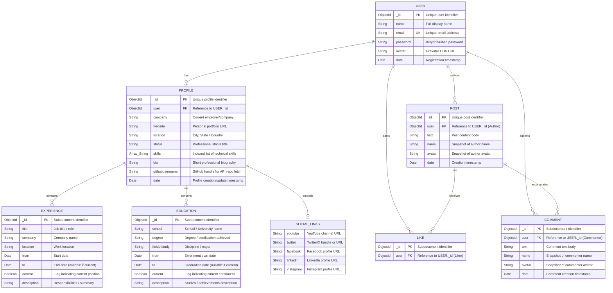
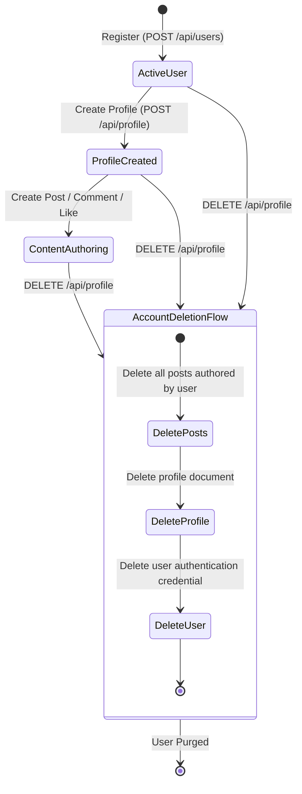

# SDLC Planning Artifact 02: Entity Relationship Model (ERD) & Data Dictionary

## Executive Summary
This document specifies the conceptual, logical, and physical entity-relationship model for the **DevConnector** platform. It provides the formal Entity-Relationship Diagram (ERD) using Crow's Foot notation in Mermaid, accompanied by a comprehensive Data Dictionary detailing constraints, indexing, nullability, and referential integrity strategies in a document database ecosystem.

---

## 1. Entity Relationship Diagram (Crow's Foot Notation)

---

## 2. Cardinality & Relationship Specification

| Entity Pair | Relationship Type | Storage Pattern | Multiplicity & Business Semantics |
| :--- | :--- | :--- | :--- |
| **USER ↔ PROFILE** | One-to-One (1 : 0..1) | Normalized Reference (`profile.user → user._id`) | A User may exist without a Profile (post-registration state), but a Profile *must* belong to exactly one User. Unique index on `profile.user` enforces this rule. |
| **PROFILE ↔ EXPERIENCE** | One-to-Many (1 : 0..N) | Embedded Subdocuments (`profile.experience[]`) | A Profile contains zero to many career experience entries. Lifespan is bound directly to the parent Profile document. |
| **PROFILE ↔ EDUCATION** | One-to-Many (1 : 0..N) | Embedded Subdocuments (`profile.education[]`) | A Profile contains zero to many academic credentials. Bound to the parent Profile document lifecycle. |
| **PROFILE ↔ SOCIAL_LINKS**| One-to-One (1 : 1) | Embedded Object (`profile.social`) | A structured value object embedded within Profile storing external platform links. |
| **USER ↔ POST** | One-to-Many (1 : 0..N) | Normalized Reference (`post.user → user._id`) | A User can author zero to unbounded posts. Stored as distinct documents in the `posts` collection to avoid MongoDB's 16MB document size limit. |
| **POST ↔ LIKE** | One-to-Many (1 : 0..N) | Embedded Subdocument Array (`post.likes[]`) | A Post contains zero or more likes. Each like references the User ID who liked the post. Uniqueness per user is enforced by domain logic. |
| **POST ↔ COMMENT** | One-to-Many (1 : 0..N) | Embedded Subdocument Array (`post.comments[]`) | Comments are embedded within the post for rapid thread retrieval in a single query. Each comment retains its own `_id`, author reference, and timestamp. |

---

## 3. Comprehensive Data Dictionary

### 3.1 Entity: `USER` (`users` collection)

| Attribute Name | Data Type | Key Type | Nullable | Default Value | Constraints & Validation Rules | Index Type |
| :--- | :--- | :--- | :--- | :--- | :--- | :--- |
| `_id` | `ObjectId` | PK | No | `ObjectId()` | Standard 12-byte BSON ObjectId | Clustered Unique (`_id_`) |
| `name` | `String` | None | No | None | Required, non-empty, trimmed | None |
| `email` | `String` | UK | No | None | Valid email format, lowercase | Unique Secondary (`email_1`) |
| `password` | `String` | None | No | None | Min 6 characters raw, stored as bcrypt hash | None |
| `avatar` | `String` | None | Yes | Derived Gravatar | HTTPS URL pointing to Gravatar CDN | None |
| `date` | `Date` | None | No | `Date.now()` | ISO 8601 UTC timestamp | None |

### 3.2 Entity: `PROFILE` (`profiles` collection)

| Attribute Name | Data Type | Key Type | Nullable | Default Value | Constraints & Validation Rules | Index Type |
| :--- | :--- | :--- | :--- | :--- | :--- | :--- |
| `_id` | `ObjectId` | PK | No | `ObjectId()` | Standard 12-byte BSON ObjectId | Clustered Unique (`_id_`) |
| `user` | `ObjectId` | FK | No | None | Refers to `users._id`; 1:1 invariant | Unique Secondary (`user_1`) |
| `company` | `String` | None | Yes | None | Optional string, max length 100 | None |
| `website` | `String` | None | Yes | None | Valid URI format if supplied | None |
| `location` | `String` | None | Yes | None | Geographic descriptor | None |
| `status` | `String` | None | No | None | Required professional status string | None |
| `skills` | `Array<String>` | None | No | None | Non-empty array of normalized strings | Multikey Index (`skills_1`) |
| `bio` | `String` | None | Yes | None | Optional text, max 500 chars | None |
| `githubusername`| `String` | None | Yes | None | Alphanumeric GitHub handle | Secondary (`githubusername_1`)|
| `experience` | `Array<Obj>` | None | No | `[]` | Array of `EXPERIENCE` subdocuments | None |
| `education` | `Array<Obj>` | None | No | `[]` | Array of `EDUCATION` subdocuments | None |
| `social` | `Object` | None | No | `{}` | Embedded map of social networks | None |
| `date` | `Date` | None | No | `Date.now()` | ISO 8601 UTC timestamp | None |

### 3.3 Subdocument: `EXPERIENCE` (`profile.experience[]`)

| Field | Data Type | Constraints | Description |
| :--- | :--- | :--- | :--- |
| `_id` | `ObjectId` | Unique within array | Subdocument primary key |
| `title` | `String` | Required | Job title (e.g. Senior Software Engineer) |
| `company` | `String` | Required | Employer name |
| `location` | `String` | Optional | Office location or "Remote" |
| `from` | `Date` | Required | Employment start date |
| `to` | `Date` | Optional | Employment end date (omitted if `current: true`) |
| `current` | `Boolean` | Default: `false` | True if currently employed in role |
| `description` | `String` | Optional | Summary of responsibilities |

### 3.4 Subdocument: `EDUCATION` (`profile.education[]`)

| Field | Data Type | Constraints | Description |
| :--- | :--- | :--- | :--- |
| `_id` | `ObjectId` | Unique within array | Subdocument primary key |
| `school` | `String` | Required | Institution / University |
| `degree` | `String` | Required | Degree or certification (e.g. B.Sc. Computer Science) |
| `fieldofstudy` | `String` | Required | Major / field of study |
| `from` | `Date` | Required | Enrollment start date |
| `to` | `Date` | Optional | Graduation date (omitted if `current: true`) |
| `current` | `Boolean` | Default: `false` | True if currently studying |
| `description` | `String` | Optional | Academic highlights / projects |

### 3.5 Entity: `POST` (`posts` collection)

| Attribute Name | Data Type | Key Type | Nullable | Default Value | Constraints & Validation Rules | Index Type |
| :--- | :--- | :--- | :--- | :--- | :--- | :--- |
| `_id` | `ObjectId` | PK | No | `ObjectId()` | BSON ObjectId | Clustered Unique (`_id_`) |
| `user` | `ObjectId` | FK | No | None | Refers to `users._id` (Author) | Secondary (`user_1`) |
| `text` | `String` | None | No | None | Required non-empty string | Text search indexable |
| `name` | `String` | None | Yes | None | Denormalized user name | None |
| `avatar` | `String` | None | Yes | None | Denormalized Gravatar URL | None |
| `likes` | `Array<Obj>` | None | No | `[]` | Array of `{ _id, user: ObjectId }` | Secondary (`likes.user_1`) |
| `comments` | `Array<Obj>` | None | No | `[]` | Array of `COMMENT` subdocuments | None |
| `date` | `Date` | None | No | `Date.now()` | Creation timestamp | Descending (`date_-1`) |

### 3.6 Subdocument: `COMMENT` (`post.comments[]`)

| Field | Data Type | Constraints | Description |
| :--- | :--- | :--- | :--- |
| `_id` | `ObjectId` | Unique within array | Subdocument primary key |
| `user` | `ObjectId` | Required, FK `users._id` | Comment author identifier |
| `text` | `String` | Required | Content body of comment |
| `name` | `String` | Optional | Author display name snapshot |
| `avatar` | `String` | Optional | Author avatar URL snapshot |
| `date` | `Date` | Default: `Date.now()` | ISO 8601 UTC timestamp |

---

## 4. Referential Integrity & Consistency Lifecycle

In MongoDB, relationships across collections (`user` → `profile`, `user` → `posts`) are un-enforced at the database engine level. The system maintains referential integrity through application-level transactions and lifecycle hooks:

