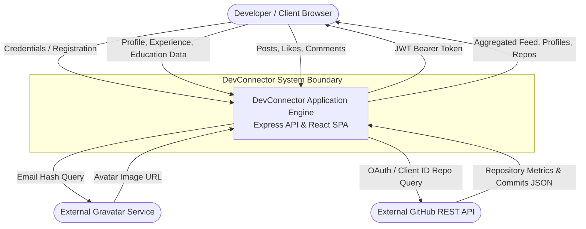
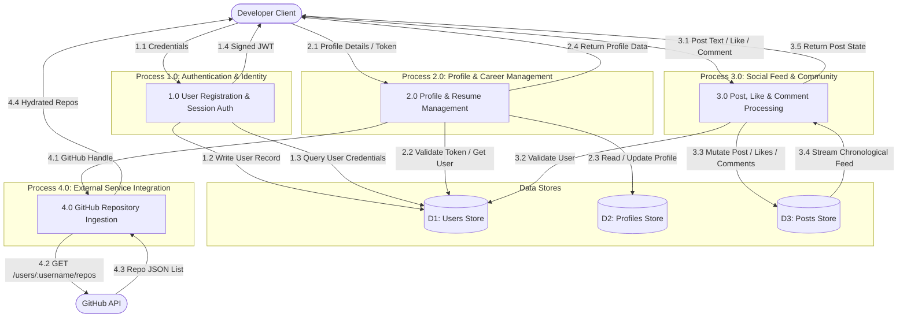
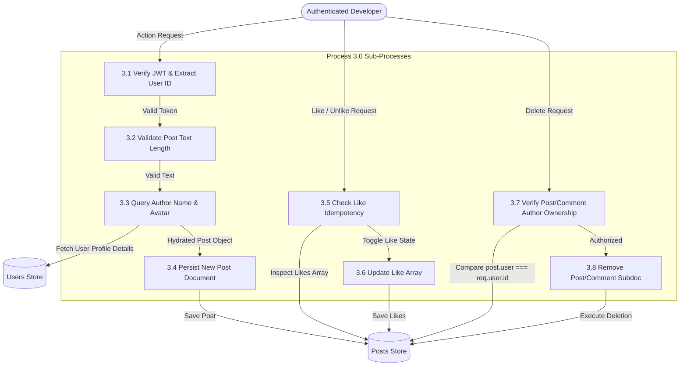
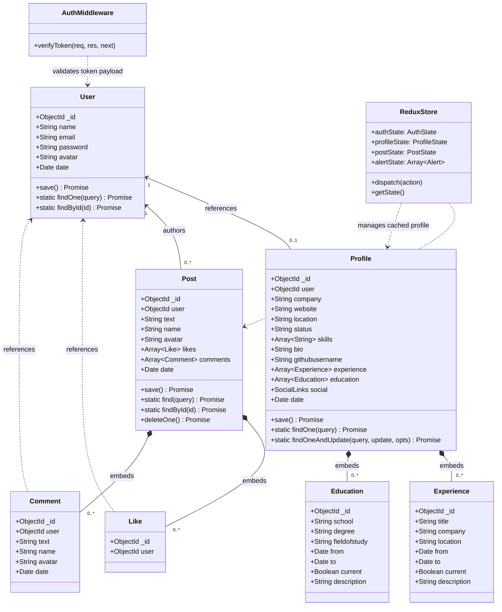
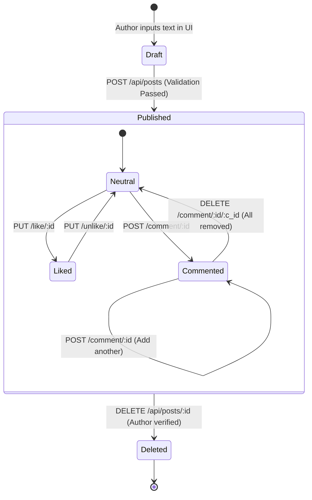
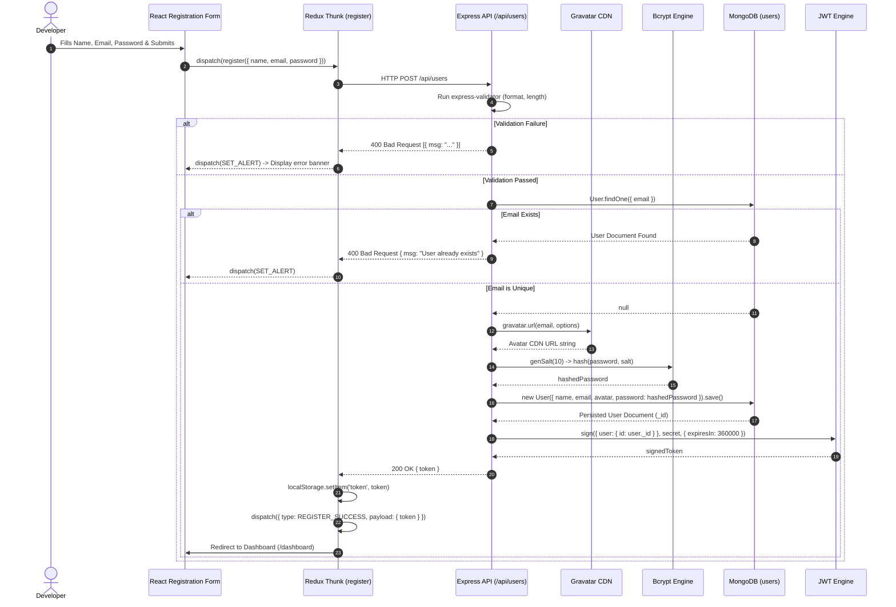
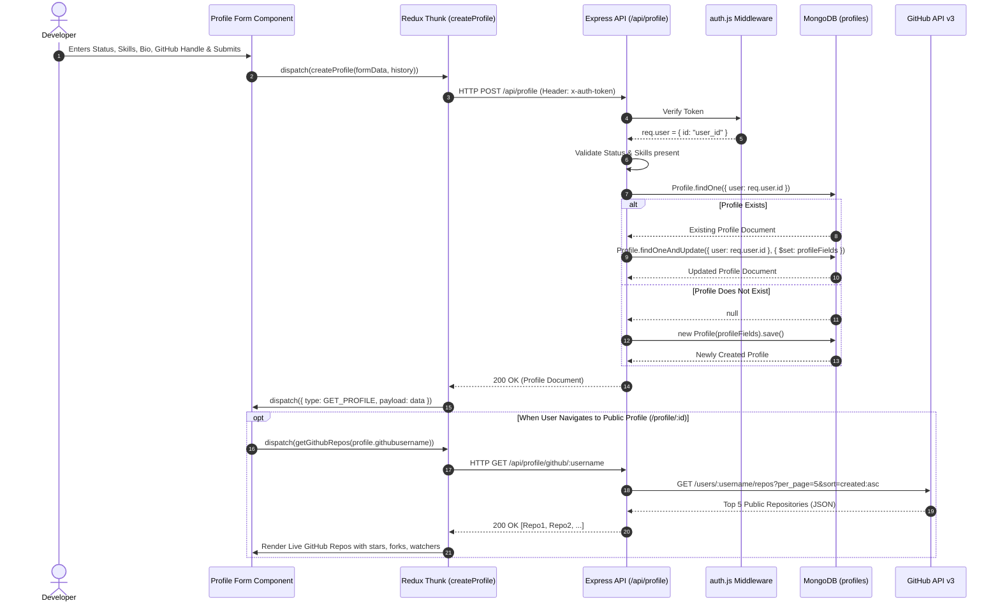
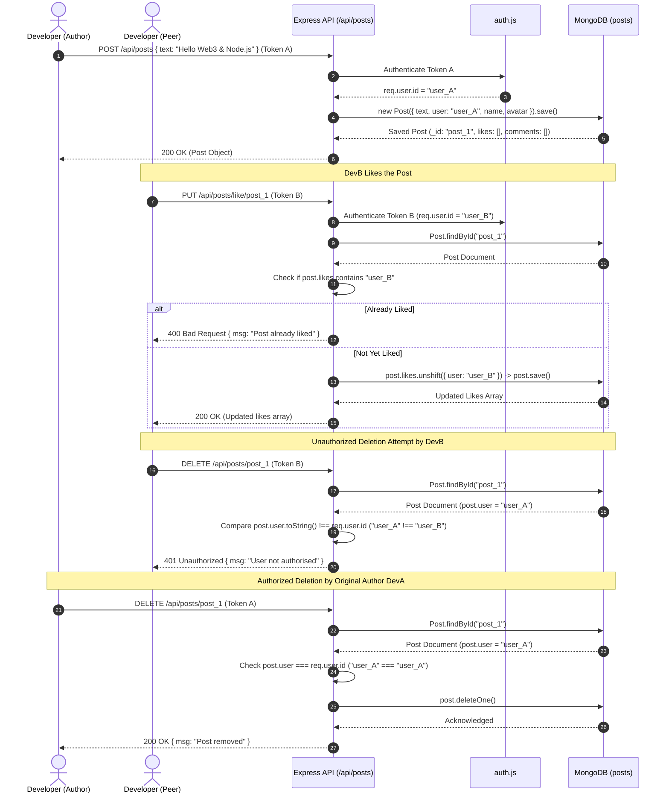
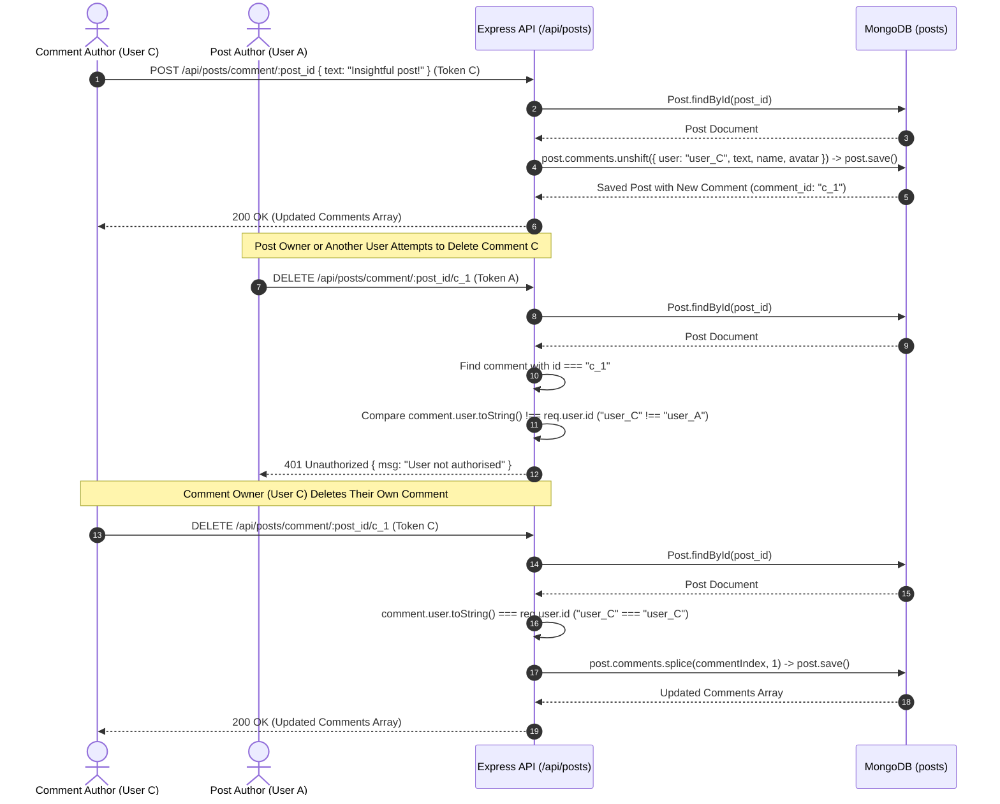

# SDLC Planning Artifact 03: System Flows & Behavioral Modeling

## Executive Summary
This document provides the formal behavioral and structural flow models for the **DevConnector** platform, including:
1. **Data Flow Diagrams (DFD)**: Level 0 (Context), Level 1 (Functional Decomposition), and Level 2 (Detailed Process Flow).
2. **UML Class Diagram & Object State Flow**: Structural relationships between Mongoose models, Express middleware/controllers, and Redux client stores.
3. **Event Sequence Diagrams**: Chronological interaction lifecycles for critical workflows (Registration & Auth, Profile & GitHub integration, Post Lifecycle with Like/Unlike, and Comment Moderation).

---

## 1. Data Flow Diagrams (DFD)

### 1.1 DFD Level 0: Context Diagram
The Level 0 Context Diagram identifies the system boundary, external human and technical entities, and the primary data flows entering and leaving the DevConnector boundary:

### 1.2 DFD Level 1: Functional Decomposition
The Level 1 DFD decomposes the core engine into four functional subsystems interacting with discrete datastores:

### 1.3 DFD Level 2: Detailed Process (Post Interaction & Social Moderation)

---

## 2. UML Class Diagram & Object Architecture

The structural architecture bridges the backend Mongoose Models and Express controllers with the frontend React components and Redux State Store:

### 2.1 Post Object State Flow

---

## 3. Event Sequence Diagrams

### 3.1 Flow 1: User Registration & JWT Issuance

### 3.2 Flow 2: Profile Creation / Update & GitHub Ingestion

### 3.3 Flow 3: Post Creation, Like/Unlike, and Owner Deletion

### 3.4 Flow 4: Comment Creation & Thread Moderation

