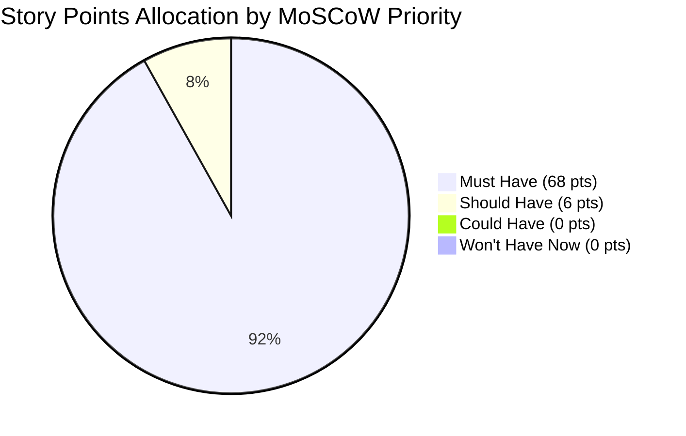

# SDLC Planning Artifact 04: Agile User Stories & Story Point Matrix

## Executive Summary
This document formalizes the complete Agile User Story backlog and sizing analysis for the **DevConnector** platform. It provides:
1. **Epic Breakdown**: Functional partitioning across 4 core business domains.
2. **User Story Specifications**: 26 granular user stories with structured role/action/benefit statements.
3. **Acceptance Criteria**: Strict Gherkin syntax (`Given... When... Then...`) for every story.
4. **Story Point Estimation**: Standard Fibonacci sequence sizing (1, 2, 3, 5, 8) with technical complexity justification.
5. **MoSCoW Prioritization & Velocity Metrics**: Release sprint allocations and aggregate burndown projections.

---

## 1. Story Point Estimation Reference Scale

Story point estimation utilizes modified Fibonacci numbers based on a triangulation of **Effort**, **Complexity**, and **Uncertainty/Risk**:

| Story Points | Complexity Tier | Typical Scope | Concrete Example in DevConnector |
| :---: | :--- | :--- | :--- |
| **1** | Trivial / Low Effort | Single UI tweak, minor schema addition, static route | Render static landing page copy, format date string |
| **2** | Low Complexity | Standard CRUD operation, straightforward API endpoint | Fetch user by ID, delete single comment |
| **3** | Medium Complexity | Form with validation, state management integration, JWT guard | Add experience/education modal with Redux dispatch |
| **5** | High Complexity | Multi-entity transaction, external API integration, auth pipeline | User registration with Gravatar and bcrypt hashing |
| **8** | Very High Complexity | Cascading lifecycle operations, multi-subdocument state machine | Complete account purge across 3 collections with error rollback |

---

## 2. Comprehensive User Story Catalog

### Epic 1: Identity, Authentication & Security (AUTH)

#### US-AUTH-01: User Registration
- **Statement**: *As a new software developer, I want to create an account with my name, email, and password, so that I can establish an authenticated identity on the platform.*
- **Priority**: **Must Have (M)**
- **Story Points**: **5** (bcrypt salting, Gravatar hash derivation, unique email constraint check, JWT token issuance)
- **Acceptance Criteria**:
  ```gherkin
  Scenario: Successful developer registration
    Given I provide a valid name "Jane Doe", unique email "jane@example.com", and password "secret123"
    When I submit the registration form
    Then the system hashes my password with a bcrypt salt factor of 10
    And generates an avatar URL using my email hash via Gravatar
    And returns a valid signed JWT bearer token
    And redirects me to the Dashboard view.

  Scenario: Duplicate email rejection
    Given a user already exists with email "jane@example.com"
    When I submit the registration form with "jane@example.com"
    Then the server responds with HTTP 400 Bad Request
    And an alert banner displays "User already exists".
  ```

#### US-AUTH-02: User Login & Credential Verification
- **Statement**: *As a registered developer, I want to log in with my email and password, so that I can securely access my private dashboard.*
- **Priority**: **Must Have (M)**
- **Story Points**: **3** (credential matching via bcrypt compare, JWT issuance, client localStorage sync)
- **Acceptance Criteria**:
  ```gherkin
  Scenario: Successful login
    Given an existing account with email "jane@example.com" and password "secret123"
    When I enter valid credentials and submit
    Then the server returns an HTTP 200 with a signed JWT
    And the client stores the token in localStorage
    And application state sets isAuthenticated to true.

  Scenario: Invalid credentials
    Given an existing account
    When I submit an incorrect password
    Then the server returns an HTTP 400 with message "Invalid Credentials"
    And no token is written to client storage.
  ```

#### US-AUTH-03: Persistent Session Verification
- **Statement**: *As an authenticated developer, I want my session to remain active upon browser refresh, so that I do not need to re-login continuously.*
- **Priority**: **Must Have (M)**
- **Story Points**: **2** (token header injection, auto-dispatch `loadUser` on SPA mount)
- **Acceptance Criteria**:
  ```gherkin
  Scenario: Load authenticated user on refresh
    Given a valid JWT exists in localStorage
    When the React application initializes
    Then Axios sets the default header 'x-auth-token'
    And dispatches a request to GET /api/auth
    And hydrates the global Redux state with user details.
  ```

#### US-AUTH-04: User Logout
- **Statement**: *As an authenticated developer, I want to log out of my account, so that I can terminate my active session on a shared computer.*
- **Priority**: **Must Have (M)**
- **Story Points**: **1** (purge localStorage token, reset Redux auth/profile state)
- **Acceptance Criteria**:
  ```gherkin
  Scenario: Developer logs out
    Given an active authenticated session
    When I click the "Logout" button in the navigation bar
    Then the token is purged from localStorage
    And Redux dispatches LOGOUT and CLEAR_PROFILE
    And the user is redirected to the Landing page.
  ```

#### US-AUTH-05: Private Route Protection
- **Statement**: *As a platform administrator, I want unauthenticated visitors redirected away from private routes, so that protected resources cannot be accessed anonymously.*
- **Priority**: **Must Have (M)**
- **Story Points**: **2** (React Router v6 `PrivateRoute` wrapper checking `isAuthenticated` & `loading`)
- **Acceptance Criteria**:
  ```gherkin
  Scenario: Anonymous access to private route
    Given a visitor with no active session
    When the visitor navigates directly to "/dashboard"
    Then the PrivateRoute guard intercepts the navigation
    And redirects the visitor to "/login".
  ```

#### US-AUTH-06: Form Input Validation & Error Alerts
- **Statement**: *As a user, I want clear and instantaneous error messages when I input invalid data, so that I can correct my inputs promptly.*
- **Priority**: **Must Have (M)**
- **Story Points**: **2** (express-validator server checks + Redux timed alert banner system)
- **Acceptance Criteria**:
  ```gherkin
  Scenario: Client alert dispatch on validation error
    When an API error occurs returning an array of validation errors
    Then Redux dispatches SET_ALERT with a generated UUID
    And an alert banner appears for 5000ms before auto-dismissing.
  ```

---

### Epic 2: Developer Profiles & Portfolios (PROF)

#### US-PROF-01: View Current User Profile
- **Statement**: *As an authenticated developer, I want to access my personal profile dashboard, so that I can see my current employment status and credentials.*
- **Priority**: **Must Have (M)**
- **Story Points**: **2** (GET `/api/profile/me` with populated user name/avatar)
- **Acceptance Criteria**:
  ```gherkin
  Scenario: User with existing profile visits dashboard
    Given an authenticated user who has created a profile
    When visiting "/dashboard"
    Then the profile information, experience list, and education list are displayed.

  Scenario: User without profile visits dashboard
    Given an authenticated user who has not created a profile
    When visiting "/dashboard"
    Then a prompt is displayed: "You have not yet setup a profile, please add some info"
    And a button "Create Profile" is provided.
  ```

#### US-PROF-02: Create Developer Profile
- **Statement**: *As a registered developer, I want to create my professional profile with bio, skills, company, and social links, so that other developers can discover my expertise.*
- **Priority**: **Must Have (M)**
- **Story Points**: **3** (POST `/api/profile`, comma-separated skill normalization, social links mapping)
- **Acceptance Criteria**:
  ```gherkin
  Scenario: Valid profile creation
    Given an authenticated user without a profile
    When submitting status "Senior Developer" and skills "JavaScript, React, Node.js"
    Then a new document is inserted into the profiles collection
    And skills are stored as an array of trimmed strings
    And the user is redirected to "/dashboard".
  ```

#### US-PROF-03: Edit Developer Profile
- **Statement**: *As a developer, I want to update my existing profile information, so that my portfolio reflects my latest career changes.*
- **Priority**: **Must Have (M)**
- **Story Points**: **2** (upsert pattern using `findOneAndUpdate` with `$set`)
- **Acceptance Criteria**:
  ```gherkin
  Scenario: Updating existing profile
    Given an authenticated user with a profile
    When updating company from "Startup A" to "Tech Corp" and submitting
    Then the profile document is updated in-place without duplicate record creation.
  ```

#### US-PROF-04: Add Employment Experience
- **Statement**: *As a developer, I want to record my previous and current employment history, so that recruiters can review my career timeline.*
- **Priority**: **Must Have (M)**
- **Story Points**: **3** (PUT `/api/profile/experience`, subdocument `$unshift` operation, date validation)
- **Acceptance Criteria**:
  ```gherkin
  Scenario: Adding a current job
    Given an existing profile
    When adding an experience with title "Tech Lead", company "Acme", from "2022-01-01", and current true
    Then the new experience is prepended to profile.experience[]
    And to date is omitted.
  ```

#### US-PROF-05: Delete Employment Experience
- **Statement**: *As a developer, I want to remove an obsolete experience entry, so that my profile remains concise.*
- **Priority**: **Should Have (S)**
- **Story Points**: **2** (DELETE `/api/profile/experience/:exp_id` with array filtering)
- **Acceptance Criteria**:
  ```gherkin
  Scenario: Deleting experience item
    Given an experience subdocument with ID "exp_1"
    When the user clicks "Delete" on that entry
    Then the subdocument is removed from the array
    And the updated profile is returned.
  ```

#### US-PROF-06: Add Education Credentials
- **Statement**: *As a developer, I want to list my university degrees and certifications, so that peers can see my academic background.*
- **Priority**: **Must Have (M)**
- **Story Points**: **3** (PUT `/api/profile/education`, subdocument insertion)
- **Acceptance Criteria**:
  ```gherkin
  Scenario: Adding academic degree
    Given an existing profile
    When submitting school "Stanford", degree "B.S.", fieldofstudy "CS", and start date
    Then the education subdocument is prepended to profile.education[].
  ```

#### US-PROF-07: Delete Education Credentials
- **Statement**: *As a developer, I want to remove an outdated education entry, so that my profile is kept accurate.*
- **Priority**: **Should Have (S)**
- **Story Points**: **2** (DELETE `/api/profile/education/:edu_id`)
- **Acceptance Criteria**:
  ```gherkin
  Scenario: Removing education entry
    When deleting education with ID "edu_1"
    Then the item is purged from profile.education[] and UI reflects the change.
  ```

#### US-PROF-08: Browse Developer Directory
- **Statement**: *As a visitor or developer, I want to view a public list of all developer profiles, so that I can network and discover community members.*
- **Priority**: **Must Have (M)**
- **Story Points**: **2** (GET `/api/profile` with populated user names and avatars)
- **Acceptance Criteria**:
  ```gherkin
  Scenario: Viewing community directory
    When a visitor navigates to "/profiles"
    Then all developer profiles are fetched and rendered as summary cards showing status, company, and top skills.
  ```

#### US-PROF-09: View Public Profile & GitHub Repositories
- **Statement**: *As a visitor, I want to view a developer's full public profile and their latest GitHub repositories, so that I can inspect their open-source contributions.*
- **Priority**: **Must Have (M)**
- **Story Points**: **5** (External GitHub REST API call with OAuth credentials, repo rendering with stars/watchers)
- **Acceptance Criteria**:
  ```gherkin
  Scenario: Inspecting profile with GitHub handle
    Given developer "bradtraversy" with githubusername "bradtraversy"
    When I view "/profile/:id"
    Then the system fetches the 5 most recent public repositories from GitHub API
    And displays repo name, description, stars count, watchers count, and forks count.
  ```

---

### Epic 3: Social Feed & Community Discussions (POST)

#### US-POST-01: Create Discussion Post
- **Statement**: *As an authenticated developer, I want to publish a text post to the community feed, so that I can ask questions and share insights.*
- **Priority**: **Must Have (M)**
- **Story Points**: **3** (POST `/api/posts`, text validation, author hydration)
- **Acceptance Criteria**:
  ```gherkin
  Scenario: Creating a new post
    Given an authenticated user
    When submitting post text "Exploring React 18 Concurrent Mode"
    Then a new document is inserted in posts collection with author name and avatar
    And the post is prepended to the global feed.
  ```

#### US-POST-02: View Chronological Feed
- **Statement**: *As a developer, I want to read all recent posts in chronological order, so that I stay updated on the latest community discussions.*
- **Priority**: **Must Have (M)**
- **Story Points**: **2** (GET `/api/posts` with `{ date: -1 }` sort)
- **Acceptance Criteria**:
  ```gherkin
  Scenario: Reading community feed
    When navigating to "/posts"
    Then posts are displayed ordered from newest to oldest.
  ```

#### US-POST-03: View Individual Post Thread
- **Statement**: *As a developer, I want to open a specific post thread, so that I can read the full discussion and all comments.*
- **Priority**: **Must Have (M)**
- **Story Points**: **2** (GET `/api/posts/:id`)
- **Acceptance Criteria**:
  ```gherkin
  Scenario: Opening post thread
    When clicking "Discussion" on a post card
    Then the browser navigates to "/posts/:id" rendering the root post and its comment list.
  ```

#### US-POST-04: Author Deletes Own Post
- **Statement**: *As a post author, I want to delete my own post, so that I can remove obsolete or accidental content.*
- **Priority**: **Must Have (M)**
- **Story Points**: **3** (DELETE `/api/posts/:id`, author verification check)
- **Acceptance Criteria**:
  ```gherkin
  Scenario: Author deletes post
    Given user A owns post P
    When user A sends DELETE /api/posts/P
    Then the post document is deleted from the database
    And Redux removes post P from state.posts.
  ```

#### US-POST-05: Non-Author Deletion Prevention
- **Statement**: *As a system defender, I want unauthorized post deletion requests rejected, so that users cannot delete peers' content.*
- **Priority**: **Must Have (M)**
- **Story Points**: **2** (Ownership assertion: `post.user.toString() !== req.user.id`)
- **Acceptance Criteria**:
  ```gherkin
  Scenario: Unauthorized delete attempt
    Given user B attempts to delete post owned by user A
    When user B sends DELETE /api/posts/P
    Then the server returns HTTP 401 Unauthorized with message "User not authorised".
  ```

#### US-POST-06: Like a Post (Idempotent)
- **Statement**: *As an authenticated developer, I want to like a post, so that I can show appreciation for high-quality content.*
- **Priority**: **Must Have (M)**
- **Story Points**: **3** (PUT `/api/posts/like/:id`, idempotency filtering)
- **Acceptance Criteria**:
  ```gherkin
  Scenario: Liking an unliked post
    Given user hasn't liked post P
    When user clicks the "Like" button
    Then user ID is pushed into post.likes array
    And the like counter increments by 1.

  Scenario: Attempting duplicate like
    Given user has already liked post P
    When user sends another like request
    Then server responds with HTTP 400 "Post already liked".
  ```

#### US-POST-07: Unlike a Post
- **Statement**: *As a developer who liked a post, I want to remove my like, so that I can retract my endorsement.*
- **Priority**: **Must Have (M)**
- **Story Points**: **2** (PUT `/api/posts/unlike/:id`, array splice)
- **Acceptance Criteria**:
  ```gherkin
  Scenario: Unliking a previously liked post
    Given user has previously liked post P
    When user clicks the "Unlike" button
    Then user ID is removed from post.likes array
    And like counter decrements by 1.
  ```

#### US-POST-08: Add Comment to Post Thread
- **Statement**: *As an authenticated developer, I want to comment on a post, so that I can participate in technical discussions.*
- **Priority**: **Must Have (M)**
- **Story Points**: **3** (POST `/api/posts/comment/:id`, subdocument creation)
- **Acceptance Criteria**:
  ```gherkin
  Scenario: Adding a comment
    Given post P
    When user submits comment text "Great architecture tips!"
    Then comment is prepended to post.comments[]
    And the comment thread immediately updates in UI.
  ```

#### US-POST-09: Delete Comment with Ownership Check
- **Statement**: *As a comment author, I want to delete my comment, so that I can remove my remarks when desired.*
- **Priority**: **Must Have (M)**
- **Story Points**: **3** (DELETE `/api/posts/comment/:id/:comment_id`, ownership validation)
- **Acceptance Criteria**:
  ```gherkin
  Scenario: Comment author deletes own comment
    Given user A authored comment C on post P
    When user A requests deletion of comment C
    Then comment C is spliced out of post.comments[] and changes are persisted.

  Scenario: Non-author attempts comment deletion
    Given user B is not the author of comment C
    When user B attempts deletion
    Then server returns HTTP 401 Unauthorized.
  ```

---

### Epic 4: Platform Integrity & Account Purging (SYS)

#### US-SYS-01: Cascading Account Deletion
- **Statement**: *As a registered user, I want to permanently delete my account, so that all my posts, profile, and credentials are completely eradicated from the system.*
- **Priority**: **Must Have (M)**
- **Story Points**: **8** (Multi-collection cascading deletion across `posts`, `profiles`, and `users`, session teardown)
- **Acceptance Criteria**:
  ```gherkin
  Scenario: Complete cascading purge
    Given an authenticated user with profile and 5 posts
    When user confirms "Delete My Account"
    Then the server deletes all 5 posts from posts collection
    And deletes the user's profile from profiles collection
    And deletes the user document from users collection
    And client state purges auth token and redirects to landing.
  ```

#### US-SYS-02: Defensive Error Handling on Malformed ObjectIds
- **Statement**: *As a system developer, I want malformed database IDs handled gracefully, so that the server does not crash with unhandled exceptions.*
- **Priority**: **Should Have (S)**
- **Story Points**: **2** (`err.kind === 'ObjectId'` error catching returning 404 instead of 500)
- **Acceptance Criteria**:
  ```gherkin
  Scenario: Request with invalid MongoDB ObjectId string
    When a request is sent to GET /api/posts/not-a-valid-id
    Then the server catches CastError and responds with HTTP 404 "Post not found".
  ```

---

## 3. Story Points Summary & Sprint Velocity Metrics

### 3.1 Aggregated Metrics Table

| Epic Code | Epic Title | User Stories Count | Total Story Points | % of Total Backlog |
| :--- | :--- | :---: | :---: | :---: |
| **AUTH** | Identity, Authentication & Security | 6 | 15 pts | 20.3% |
| **PROF** | Developer Profiles & Portfolios | 9 | 25 pts | 33.8% |
| **POST** | Social Feed & Community Discussions | 9 | 24 pts | 32.4% |
| **SYS** | Platform Integrity & Account Purging | 2 | 10 pts | 13.5% |
| **TOTAL** | **Complete DevConnector Platform** | **26 Stories** | **74 Points** | **100%** |

### 3.2 MoSCoW Prioritization Breakdown



### 3.3 Sprint Allocation & Velocity Projections (2-Week Sprints)

- **Sprint 1 (Velocity: 20 pts)**: Setup & Epic 1 (Identity & Auth: 15 pts) + Epic 2 Core Profile Models (5 pts).
- **Sprint 2 (Velocity: 20 pts)**: Epic 2 Completion (Experience, Education, Directory, GitHub API: 20 pts).
- **Sprint 3 (Velocity: 20 pts)**: Epic 3 Core (Feed, Post authoring, Likes, Comments: 20 pts).
- **Sprint 4 (Velocity: 14 pts)**: Epic 3 Polish + Epic 4 (Cascading Account Deletion & System Integrity: 14 pts).
