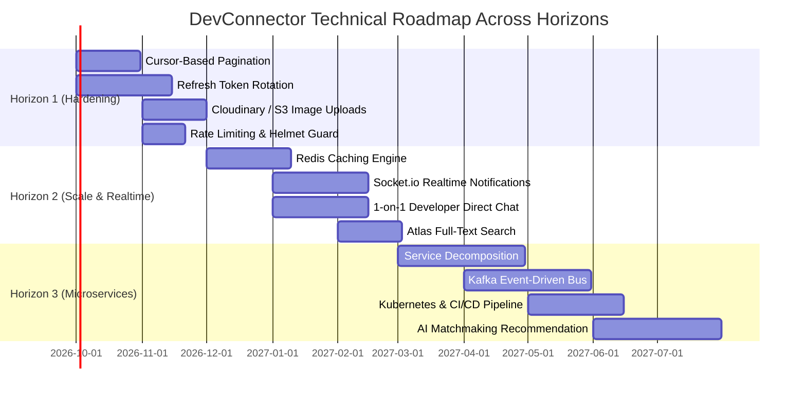
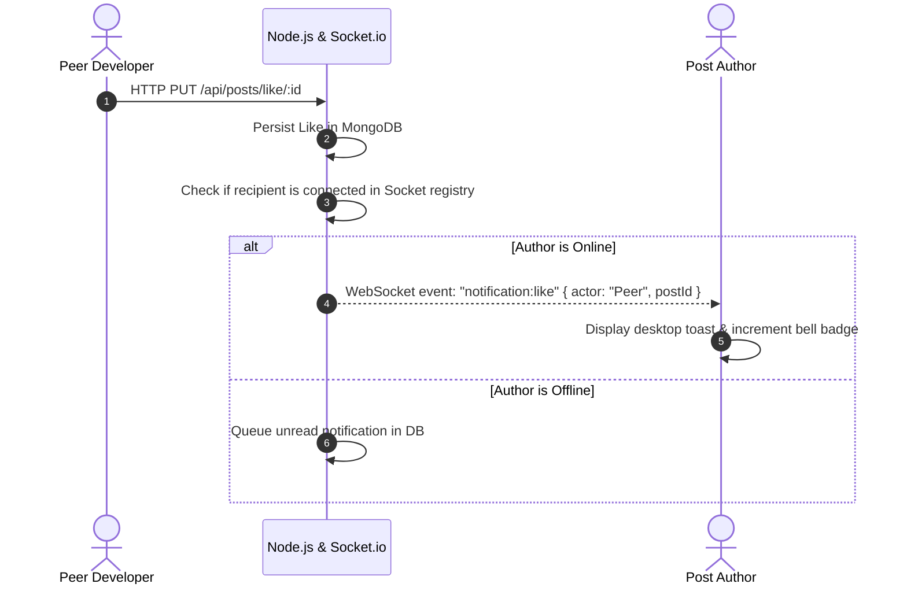
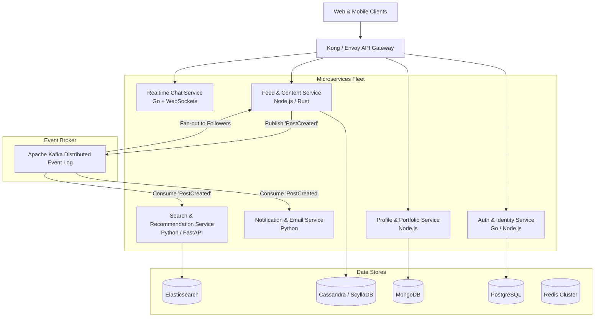

# SDLC Planning Artifact 05: Further Work & Architectural Roadmap

## Executive Summary
This document delineates the post-MVP evolution path, technical debt remediation strategy, and architectural growth roadmap for the **DevConnector** platform across three strategic horizons:
- **Horizon 1 (Near-Term Hardening & Essential Capabilities)**: 0 – 3 Months
- **Horizon 2 (Mid-Term Scale, Real-Time & Engagement)**: 3 – 6 Months
- **Horizon 3 (Enterprise Modernization & Microservices Decomposition)**: 6 – 12+ Months

---

## 1. Technical Debt & Current Vulnerability Assessment

A critical review of the baseline codebase highlights four architectural vulnerabilities requiring systematic remediation:

| ID | Component / Area | Technical Debt Description | Risk Level | Architectural Remediation |
| :---: | :--- | :--- | :---: | :--- |
| **TD-01** | Feed & Directory Endpoints | **Unbounded Queries (`Post.find()`, `Profile.find()`)**: Endpoints return entire database collections without cursor pagination or `limit`/`skip`. Will exhaust node heap memory at >1,000 documents. | **CRITICAL** | Implement cursor-based pagination with `limit` (default: 20) and `after_id` / timestamp keyset pagination. |
| **TD-02** | Authentication Strategy | **Static Long-Lived JWT (100 hours)**: Tokens cannot be revoked or invalidated prior to expiration. If stolen, an attacker retains indefinite access. | **HIGH** | Implement dual-token architecture (15-min short-lived access token + 7-day HTTP-only refresh token rotated in Redis). |
| **TD-03** | Profile Deletion Flow | **Non-Transactional Cascading Deletion**: Account deletion performs sequential asynchronous deletions (`Post.deleteMany()`, then `Profile.findOneAndDelete()`, then `User.findOneAndDelete()`). A server crash midway leaves orphaned records. | **HIGH** | Wrap operations inside a MongoDB replica-set transaction session (`session.withTransaction()`). |
| **TD-04** | Third-Party API Limits | **Uncached External GitHub Queries**: Every hit to `/api/profile/github/:username` calls GitHub's external REST API. High traffic causes HTTP 403 rate-limit exhaustion. | **MEDIUM** | Introduce Redis caching layer with a 1-hour Time-to-Live (TTL) for repository responses. |
| **TD-05** | Avatar Management | **Rigid Gravatar Dependency**: Users cannot upload custom profile pictures or project banners; relies solely on whether their email is registered with Gravatar. | **MEDIUM** | Implement direct multi-part S3/Cloudinary presigned URL image uploading. |

---

## 2. Three Horizons of Architectural Growth



---

## 3. Horizon 1: Immediate Hardening (0 – 3 Months)

### 3.1 Cursor-Based Pagination
- **Problem**: Baseline `GET /api/posts` returns all posts in the database:
  ```javascript
  const posts = await Post.find().sort({ date: -1 });
  ```
- **Target Implementation**: Replace with Keyset (Cursor) Pagination:
  ```javascript
  const limit = parseInt(req.query.limit, 10) || 10;
  const cursor = req.query.cursor;
  const query = cursor ? { _id: { $lt: new mongoose.Types.ObjectId(cursor) } } : {};
  const posts = await Post.find(query).sort({ _id: -1 }).limit(limit + 1);
  const hasMore = posts.length > limit;
  const results = hasMore ? posts.slice(0, -1) : posts;
  res.json({ results, nextCursor: hasMore ? results[results.length - 1]._id : null });
  ```

### 3.2 Dual-Token Architecture with Refresh Tokens
- **Design**:
  - Access Token: 15-minute lifespan, stored in memory.
  - Refresh Token: 7-day lifespan, stored in an `HttpOnly`, `SameSite=Strict`, `Secure` cookie.
  - Invalidation: Token family rotation with automatic revocation in Redis upon reuse detection.

### 3.3 Media Storage Service (AWS S3 / Cloudinary)
- Add presigned upload URLs allowing developers to upload custom profile avatars, cover images, and markdown attachments within posts.

### 3.4 Defensive Middleware
- Integrate `helmet` for HTTP security headers (CSP, HSTS, X-Frame-Options).
- Integrate `express-rate-limit` to restrict brute-force attempts on `/api/auth` (10 requests per 15 minutes) and API hammering (100 req/min).

---

## 4. Horizon 2: Real-Time, Caching & Engagement (3 – 6 Months)

### 4.1 Real-Time Notifications via WebSockets (Socket.io)
When a developer receives a like or a comment on their post, an instant event is broadcast to the recipient's active socket channel:



### 4.2 Distributed Caching with Redis
- Cache developer profile by ID and username with cache invalidation on `POST /api/profile`.
- Cache GitHub repository payload for 3,600 seconds to protect third-party rate quotas.

### 4.3 Direct 1-on-1 Developer Messaging
- Introduce encrypted private conversations between developers with read receipts, typing indicators, and message history.

### 4.4 Atlas Full-Text Search
- Replace in-memory filtering with MongoDB Atlas Search Lucene indexes on `skills`, `bio`, `company`, and `post.text`.

---

## 5. Horizon 3: Long-Term Enterprise Evolution (6 – 12+ Months)

### 5.1 Microservices Decomposition & Event-Driven Architecture

As the platform scales beyond 100,000 active daily users, the monolithic Express service is decomposed into specialized, independently scalable microservices communicating via an Apache Kafka or RabbitMQ event bus:



### 5.2 CI/CD Automation & Cloud Infrastructure
- **Containerization**: Multi-stage Docker builds with Alpine Linux bases.
- **Orchestration**: Kubernetes (EKS / GKE) with Horizontal Pod Autoscalers (HPA) configured on CPU/Memory thresholds (>70%).
- **Continuous Delivery**: GitHub Actions pipeline executing automated unit tests, linter checks, SonarQube static security analysis, and zero-downtime rolling deployments.

### 5.3 AI-Powered Developer Recommendation Engine
- Machine learning vector embeddings (using OpenAI / HuggingFace models) on developer skills, repositories, and authored posts.
- Semantic similarity search to recommend relevant peers to follow, open-source repositories to contribute to, and matching job opportunities.
